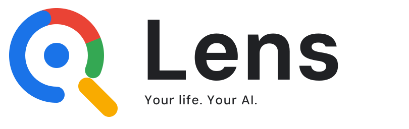

<p align="center">
  <picture>
    <source media="(prefers-color-scheme: dark)" srcset="docs/brand/lens-horizontal-dark-tagline.svg">
    
  </picture>
</p>

# Lens

**Usable context for you and your agents.** Lens remembers what actually happened, and shows you the exact moment.

## Install

```bash
curl -fsSL https://raw.githubusercontent.com/adeelahmad/lense/main/install.sh | sh
```

That one line is all: it installs Docker if needed, starts Lens and opens the setup page, where a short wizard asks
for a namespace, a model provider and storage ([details](docs/get-started.md#in-one-line)). Run it again to update.
[Deployment](docs/deployment.md) covers servers and Cloudron; there are also packages for
[Synology](packaging/synology/README.md), [QNAP](packaging/qnap/README.md) and [Proxmox](proxmox/README.md).

To work on the code instead, `make run` builds and runs everything from a checkout, `make setup-code` prints the
first-admin setup code, and `make dev` runs it with hot reload; see [Get started](docs/get-started.md).

Lens is one private AI hub for your whole life. Every source is a sensor: recordings, documents, email, calendars,
chat rooms, devices and webhooks all flow in, and everything becomes memory you can trust, because every answer cites
where it came from, down to the second of a recording or the line of a document. It runs on your own hardware, from a
Raspberry Pi to the cloud, and you own every byte.

Lens is built first for agents and AI assistants. After setup, most people do two things: talk to an assistant that
finds and fetches what they need, and look at the charts and reports that show what is in their archive and what it
cost.

## What you can do with it

- **Ask, and get cited answers.** A chat assistant on every page (and by voice) searches, reads and cites your
  archive, and acts on it with tools: changes wait for your approval. Each namespace can have its own assistant with
  its own name, instructions and memory, and the assistant can answer in Slack, Discord, Telegram, Matrix and other
  chat rooms. ([Chat](docs/assistant.md), [chat rooms](docs/chat-rooms.md))
- **Connect your agents.** Lens is an MCP server (`/mcp`) with 25 tools for search, transcripts, citations, the
  graph, topics and notes. Agents sign in with OAuth and see only what their person may read. ([MCP](docs/mcp.md))
- **Bring in everything.** Watched folders on S3, Dropbox, Google Drive, OneDrive, SFTP, SMB, WebDAV or local disks;
  IMAP mail and iCal calendars; a built-in MQTT broker, syslog and webhook streams; uploads of audio, video, PDFs,
  Office files, web pages and transcripts. ([Sensors](docs/sensors.md), [processing](docs/processing.md))
- **Understand it.** Transcription and speaker recognition, entities and topics in a knowledge graph you can explore,
  query with Cypher or SPARQL, and see as it was at any version. ([Graph](docs/graph.md),
  [graph history](docs/graph-history.md), [topics](docs/topics.md), [video](docs/video.md))
- **Keep notes beside it.** Every recording, entity and topic has a page, plus free notes that you and the assistant
  write and link. ([Notes](docs/notes.md))
- **Automate it.** Pipelines and workflows on a canvas, routines on a schedule, and extensions (prompts, templates and
  sandboxed Python) the assistant can call.
- **See what it costs.** An activity ledger of every model call, with reports, charts and budgets that cap spending.
  Routine choices go to small decision models, and the LLM only when it adds value.
  ([Activity and costs](docs/activity.md), [budgets](docs/budgets.md))
- **Stay private.** Passkeys instead of passwords, encryption at rest with a key per namespace, roles per namespace,
  and an audit log. Reach it from anywhere through a Cloudflare tunnel with nothing opened on your router.
  ([Encryption](docs/encryption.md), [authentication](docs/authentication.md), [remote access](docs/remote-access.md))
- **Use open standards.** RDF and Dublin Core for every record, OIDC sign-in for other apps, MQTT, IIIF for
  publishing, OpenTelemetry for monitoring, and an optional Fedora mirror. ([Linked data](docs/rdf.md),
  [IIIF](docs/iiif.md), [telemetry](docs/telemetry.md))

## Light by default

Lens runs on a small machine. Heavy parts (local speech models, a local LLM, document conversion, Fedora) stay off or
download only when you turn them on, and any of them can be swapped for a cloud provider instead. Every setting lives
in the web app. ([Components](docs/components.md), [speech providers](docs/speech-providers.md),
[local models](docs/local-models.md))

## In progress

- An import webhook that pushes files into a namespace with its own token.
- Routing rules that sort a shared inbox into namespaces.
- Setting up a namespace's assistant and its chat rooms from the web app.

## Stack

| | |
|---|---|
| `fastapi_backend/` | FastAPI API (`/api/v1`), MCP server, the processing engine, and the `lens` CLI and workers |
| `nextjs-frontend/` | Next.js web app with a typed client generated from the API's OpenAPI schema |
| SurrealDB | documents, graph edges, the job queue and graph history; word search in a small SQLite index beside it |

## Documentation

Start with [Get started](docs/get-started.md), then [Architecture](docs/architecture.md),
[Configuration](docs/configuration.md), [API](docs/api.md) and [Deployment](docs/deployment.md). The full guide list is
in the [docs](docs/) folder. [Contributing](CONTRIBUTING.md), [Security](SECURITY.md),
[Changelog](CHANGELOG.md).

Built on the [Next.js FastAPI Template](https://github.com/vintasoftware/nextjs-fastapi-template) (MIT).
