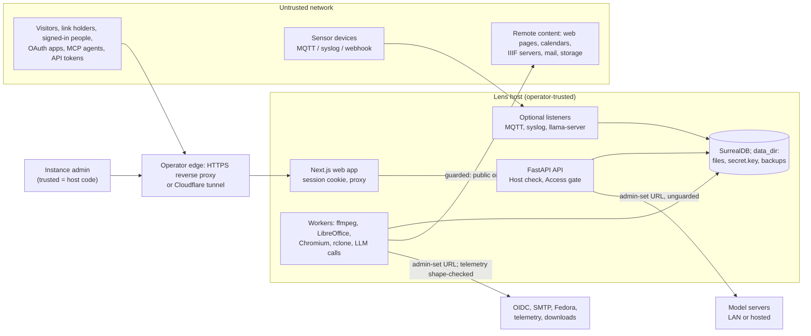

# Lens threat model

## 1.1 Header

- **Project**: Lens, a self-hosted archive for recordings, transcripts and documents (repository `adeelahmad/lense`).
- **Modeled version**: commit `5f799f2ff8bb8a762d8151d9b10b535a17878b55` on `main`, dated 2026-10-05. The repository has
  no release tags. The manifests say 0.3.0, and everything since 0.3.0 sits under "Unreleased" in `CHANGELOG.md`.
- **Date and authors**: 2026-10-05. Drafted with AI tooling (below). The maintainer, Adeel Ahmad, answered question
  waves 1 and 2.
- **Generation metadata**:
  - Model/agent: orchestrator, authoring, revision and sidecar by Claude Opus 5.5 (`claude-opus-5-5`); recon,
    surface and backtest specialists by Claude Sonnet 5.5 (`claude-sonnet-5-5`).
  - Effort level: default.
  - Skills: threat-model orchestrator 1.2.1, threat-model-recon, threat-model-surface, threat-model-interview,
    threat-model-authoring (draft and phase 3.7 revision), threat-model-backtest, threat-model-sidecar.
- **Version binding**: a report against commit *N* is judged against this model as it stood at *N*, not against
  `main`. Only the latest release and `main` get fixes *(documented, SECURITY.md section "Supported versions")*.
- **Reporting**: report a breach of a §1.11 property privately, as `SECURITY.md` "Reporting a vulnerability" says.
  Reports that land in §1.3 or §1.12 are closed by citing this document. `SECURITY.md` stays the reporting policy and
  links here *(maintainer, 2026-10)*.
- **Status**: under maintainer review (2026-10-05); waves 1 and 2 answered, §1.18 open. An **inferred** claim may
  escalate a report but never close it; under `strict` an **assumption** also escalates only.
- **Triage policy**: `strict`.
- **Provenance legend**: **documented** names a locator in project docs, `SECURITY.md`, a contract-stating docstring
  or user-facing message, or changelog rationale. **maintainer** is dated: said in this process. **assumption** (a
  cautious default the author acts on) and **inferred** (read from code, still open) carry a §1.18 question number.
- **Draft confidence**: 200 documented / 46 maintainer / 91 inferred / 8 assumption (counted over the whole file, including tags that wrap across lines).
- **Backtest note**: Backtested 117 items in 114 clusters, covering all 8 in-scope runtime families and the 60
  contract-dimension cells present at the first run; rows added in 3.7 are routed only where a corpus item reaches
  them. 36 carry a real historical outcome (31 fixed Lens defects, 5 dependency bumps); 81 are synthesized and counted
  apart. Routed: 47 VALID, 24 MODEL-GAP (all owned by an `unresolved` row and a §1.18 question), 0 VALID-HARDENING,
  27 BY-DESIGN: property-disclaimed (14 closed, 13 escalated), 16 OUT-OF-MODEL (3 trusted-input closed,
  5 non-default-build: 4 closed and 1 escalated, 1 adversary-not-in-scope closed, 6 dependency-contract: 1 closed and
  5 escalated, 1 unsupported-component escalated), 3 KNOWN-NON-FINDING closed. Fail-safe figure: 0 of 31 historically
  fixed items route to a closed or provisional disposition, and none route to a closing disposition as escalated; scored
  per sub-fix (two corpus rows bundle two fixes each) it is still 0 of 33. The one closed dependency-contract route is
  a dependency bump (Starlette and FastAPI), not a fixed Lens defect. 26 of 117 items (22%) close outright and 46 (39%)
  carry a closing disposition, 20 of them only escalated; every close is documented or maintainer tagged. The first run
  found 5 fixed items closed and 4 contradictions; the 3.7 revisions removed the closes. The contradictions were
  resolved from documents or the maintainer's 2026-10 ruling except the admin-operand guards, which raised Q35;
  the gaps raised Q36 to Q47.
- **Sibling models**: none. One model covers the API, web app, workers, CLI and packaging.

**What Lens is.** Lens stores people's recordings, transcripts and documents. It transcribes, indexes and publishes
them, and people search and chat over them. An operator runs one instance for their own users: a FastAPI API, a
Next.js web app that proxies the API and holds the sign-in session, and background workers, around one SurrealDB
database. Content is split into **namespaces**; people get roles per namespace.

**Short glossary.**

| Term | Plain meaning |
| --- | --- |
| Disposition | The one bucket a report lands in after triage (§1.17). |
| Sink | The exact place a report targets: a route, a parameter, a tool. |
| Control kind | What an attacker controls: data, size/rate, type, code, a URL, a credential. |
| Taint | How untrusted an output is. |
| Claimed / disclaimed | A property Lens promises (§1.11) or openly does not promise (§1.12). |
| False friend | A feature that looks like a security control but is not one. |
| Tier | `security-critical` (a breach is a vulnerability) or `correctness-only` (a bug, not a hole). |
| Trusted input | Something only the instance admin or host operator can set. |
| Escalated | The model has a route, but the claim behind it is not confirmed, so a maintainer decides. |
| Namespace | A tenant-like space of recordings. People have no role, or viewer, editor or owner in it. |
| Signed link | A URL the server signs. Whoever holds it can open that one path until it expires. |

> **Triager quick-start.** Given an inbound finding:
> 0. This model's triage policy is `strict`. An **assumption** may escalate but not close.
> 1. Find the sink. Look up its operand class in the §1.7 trust table, or its output channel in §1.8.
> 2. Find the contract dimension (numeric limits, failure atomicity, recursion, callback/collaborator, serialization,
>    lifecycle, concurrency, resource cost, or the `x-` rows). Follow the family's matrix row in §1.7 to its owner.
> 3. Check what the attacker needs. Which role (§1.10)? Which control kind (§1.7)? A URL only an admin can set, or
>    code only an admin can write, is trusted input, unless Lens documents a guard on it (P-ADMIN-GUARD).
> 4. Check the component against §1.2 and §1.3, and any configuration against §1.6.
> 5. If the root cause is in a dependency, apply §1.9.
> 6. Apply the §1.17 precedence order, starting with an exact §1.15 match.
> 7. Assign exactly one §1.17 disposition and cite the licensing section and its tag. If none fits, assign
>    `MODEL-GAP` and trigger §1.16.
> 8. **Provenance gate, before any close** (`OUT-OF-MODEL: *`, `BY-DESIGN: *`, `KNOWN-NON-FINDING`):
>    - **documented** or **maintainer** licence: close.
>    - **inferred** licence: escalate, never close.
>    - **assumption** licence: escalate (policy is `strict`).
>    - A disclaimer that rests only on silence never closes a `security-critical` report, a `KNOWN-NON-FINDING` or a
>      `dependency-contract` route.
>    Record the status as `closed`, `provisional` or `escalated` (§1.17). `VALID` and `MODEL-GAP` take no status.

## 1.2 Scope and intended use

**Intended use.** One operator (the instance admin) runs Lens for their own people. Recordings, transcripts and
documents "matter most" *(documented, SECURITY.md "What counts")*. It is supported to expose an instance to the public
internet behind HTTPS, through a reverse proxy or a Cloudflare tunnel. Anonymous visitors then reach the sign-in page,
share links, the embed player and public IIIF *(maintainer, 2026-10)*.

**Roles and trust.** Only the instance admin is trusted, and an admin is equivalent to code execution on the host. The
host operator (who edits `.env` and `archive.yaml`) is as trusted as the admin. Namespace owners, editors and viewers,
API-token holders, OAuth apps and MCP agents are trusted only as far as their role *(maintainer, 2026-10)*. Role
powers follow docs/architecture.md *(documented, docs/architecture.md "Access model")* and Aviary's matrix
*(documented, docs/access.md "the roles and permissions matrix of Aviary")*. Workers may run on other machines;
optional listeners (MQTT, syslog, tunnel, local model server) run inside workers.

| Family (short name) | Representative entry points | Touches outside the process | In model? |
| --- | --- | --- | --- |
| Web app & API gateway (Web) | `nextjs-frontend/proxy.ts`, `lib/api/backend-proxy.ts`, `next.config.mjs`; `core/middleware.py` Host check and CSP | network | In |
| Identity & sessions (Identity) | `routes/{auth,passkeys,oauth,external,setup,users}.py`, `domain/{auth,passkeys,oauth,external_login,iiif_auth}.py`, `core/security.py`, `nextjs-frontend/auth.ts` | DB, OIDC providers, SMTP, logs | In |
| Authorization & data API (AuthZ) | `api/deps.py` (`Access`, `Writer`, `Admin*`), `domain/access.py`, `domain/ipgroups.py`, share links, `api/media.py`, `api/iiif.py`, `api/pages.py`, `api/mcp_tools.py` | DB, files | In |
| Outbound fetchers & stored secrets (Outbound) | `domain/netguard.py`, `webcapture.py`, `feeds.py`, `notify.py`, `sources.py`, `llm.py`, `semantic.py`, `speech.py`, `fedora.py`, `bridge.py`, `telemetry.py`, `settings.py` seal, `keyring.py`, `vaults.py` | network, child processes, files | In |
| Ingest & processing (Ingest) | `routes/{uploads,files,imports}.py`, `domain/{ingest,documents,convert,video,uploads}.py`, `templates.py`, `render.py` | child processes (ffmpeg, LibreOffice, Chromium, poppler, Tesseract), files | In |
| Query engines (Query) | `domain/cypher.py`, `domain/rdf.py` (SPARQL), `domain/rdf_import.py`, `domain/search.py` | DB | In |
| Assistant & extensions (Assistant) | `domain/{chat,ai_tools,ops_tools,extensions,tool_nodes,flow,custom_nodes,code_tools}.py`, MCP write tools | network (model servers), child process (code tools) | In |
| Optional services, off by default (Optional) | `domain/{sensors,mqtt,syslog}.py`, `tunnel.py`, `local_llm.py`, `components.py`, `telemetry.py` | listening sockets, downloads, child processes | In |
| Packaging variants | `docker-compose.prod.yml`, `install.sh`, `cloudron/`, `packaging/{synology,qnap}`, `proxmox/` | host | §1.6 |
| Dev and CI tooling, samples | `docker-compose.yml`, `make dev`, `.github/`, `ci/`, `examples/`, `overrides/`, `prod-frontend-deploy.yml`, `watcher.py`, `commands/`, `fastapi_backend/tests/` | host | Out (§1.3) |

## 1.3 Out of scope

- **Admin and host-operator actions.** Anything that needs the instance admin or host operator is trusted input:
  admin-set URLs, admin-written code tools, templates, workflows and regexes, component installs, break-glass
  environment variables, and `api_key_env` *(maintainer, 2026-10)*. This includes "an admin to configure Lens
  insecurely on purpose" *(documented, SECURITY.md "Out of scope")*. It does not include the guards Lens documents on
  admin-set operands (P-ADMIN-GUARD): an escape of one of those is in model.
- **Volume denial of service.** "denial of service by sheer volume" is out *(documented, SECURITY.md "Out of scope")*.
- **Unreached dependency bugs.** "vulnerabilities in dependencies that Lens doesn't reach" are out *(documented,
  SECURITY.md "Out of scope")*. Such a report routes `OUT-OF-MODEL: dependency-contract` only with a cited argument
  that Lens never calls the vulnerable code; otherwise §1.9 decides.
- **Exposed hosts on shipped defaults.** Plain HTTP, the SurrealDB `root`/`root` credential and similar defaults are
  supported on one machine only. A report that needs them on an exposed host is out (§1.6) *(maintainer, 2026-10)*.
- **Dev compose and `make dev`.** `docker-compose.yml` and `make dev` are dev-only and unsupported for exposure
  *(maintainer, 2026-10)*. The close covers findings that need their known secrets (such as
  `dev-only-access-secret-change-me`), `SURREAL_PASS=root`, or the web port on all interfaces *(maintainer, 2026-10)*.
  The compose hardening Lens documents is claimed for both compose files (P-HARDENED). Any other default exposure of
  the dev stack is not closed here: it routes `VALID` under P-HARDENED until Q36 is answered *(inferred, Q36)*.
- **Tampered upstream downloads.** Lens trusts HTTPS and the upstream publisher for llama.cpp, cloudflared, pip
  installs and `hf:` models, and claims nothing more *(maintainer, 2026-10)*.
- **Unsupported paths**, each checked against every Dockerfile and packaging script; none is built into a running
  service *(assumption, Q34)*:
  - `examples/` (source clone only), `overrides/` (mkdocs theme), `ci/`, `.github/`, `.pre-commit*` (CI, in no
    image), and `prod-frontend-deploy.yml` (a stale Vercel workflow Actions does not run).
  - `fastapi_backend/tests/`, `watcher.py` and `commands/`: copied into the backend image by `COPY . .` but never
    started by the production command. A report must show production code reaching them.

## 1.4 Trust boundaries and data flow

- **B1, network to web app.** Everything a browser, app or agent sends is untrusted. The web app forwards
  `/api`, `/mcp`, `/iiif`, `/embed` and `/s` to the API, which authorizes every call.
- **B2, request to role.** The API turns a bearer token, signed link, share link, IIIF cookie or vouched-for address
  into a role per namespace. This is the main boundary, and namespace isolation lives here, in application code.
- **B3, content to parser.** Uploaded and fetched bytes cross into ffmpeg, LibreOffice, Chromium, poppler, Tesseract and
  the LLM prompt.
- **B4, Lens to the outside.** Fetches whose URL a non-admin sets, and iCal feeds, go through `netguard`. Other
  admin-set URLs do not; the telemetry endpoint is only shape-checked (P-ADMIN-GUARD).
- **B5, peers.** Workers, the API and the web app trust the database and each other. Workers hold the DB credential.
- **B6, devices.** Sensor listeners take traffic from the LAN (or wider, per `sensors.bind`) once an admin enables them.

**Reachability preconditions.** A finding is in model only if it meets its family's condition:

| Family | In model only if |
| --- | --- |
| Web | It is reachable from a browser request and changes what the API decides or what another person's browser runs. |
| Identity | It is reachable with no account, or with an account, and yields a session, token or admin the attacker was not given. Setup-code findings apply only while no account exists *(documented, docs/authentication.md "one-time **setup code**")*. |
| AuthZ | It lets a principal read or change more than its role and the recording's access level allow, or open media without a link the server signed for it *(documented, SECURITY.md "What counts")*. |
| Outbound | A URL a non-admin sets, or a guarded admin operand, reaches a non-public address; or a stored secret reaches anyone but the host the admin set *(maintainer, 2026-10)*. |
| Ingest | It is reachable from bytes an editor uploads or a watched source delivers, and the fault is in how Lens runs the tool (arguments, environment, timeouts, sandbox flags). |
| Query | Query text from a non-admin reads outside the caller's namespaces, writes, fetches, or reaches SurrealQL. |
| Assistant | A non-admin (or content steering the model for one) exceeds the person's reads, changes data without approval outside notes and admin setup, or runs code on the host. |
| Optional | The service is turned on by an admin, and the attacker lacks the login, network or token the feature requires. |

## 1.5 Assumptions about the environment

- **Host.** Linux containers, an LXC on Proxmox, a NAS package, or a native install on Linux or macOS. The host and its
  root user are trusted *(maintainer, 2026-10)*.
- **Database.** One SurrealDB database holds every namespace *(documented, docs/database.md "SURREAL_NS=archive")*,
  with optimistic, retried transactions *(documented, docs/database.md "optimistic")*. The embedded engine "is for
  trying Lens and small archives" *(documented, docs/database.md "is for trying Lens")*.
- **Clock and processes.** Expiry uses wall-clock time with no skew handling *(assumption, Q5)*. Several API processes
  and workers may run at once; throttle counters and the setup code live in each process's memory *(inferred, Q5)*.

**Host side effects.** Lens makes no outbound connection except to configured sources, model servers, mail,
notification and telemetry targets; telemetry is off by default and there is no update check *(maintainer, 2026-10)*.

| Behaviour | Observed | Tag |
| --- | --- | --- |
| Default outbound calls (exceptions to the rule above) | `components.auto` (on by default) runs pip installs and fetches hashed model files; llama.cpp and cloudflared come from GitHub "latest" when those features are on; `hf:` models from Hugging Face | *(maintainer, 2026-10)* |
| Other outbound calls | none found in Lens code outside the configured destinations | *(assumption, Q19)* |
| Optional ML extras | some download weights on first use on their own (Hugging Face, ModelScope) | *(inferred, Q19)* |
| Env proxies | plain `urllib` callers honour `HTTP(S)_PROXY`; the guarded openers ignore it | *(assumption, Q19)* |
| Child processes | rclone, ffmpeg/ffprobe, LibreOffice, Chromium, Tesseract, poppler tools, antiword/catdoc, cloudflared, llama-server, `unshare` + Python for code tools, uv/pip; all as argument lists | *(assumption, Q20)* |
| Listening sockets | API and web app; a `netguard` proxy on loopback during captures; MQTT 1883 and syslog 5514 on `sensors.bind` (default `0.0.0.0`) when sensors are on; llama-server on its port (0.0.0.0 in containers, with its own API key) | *(assumption, Q19)* |
| Logs | the setup code and a `/setup?code=` link at WARNING; sign-in and reset links when mail is not set | *(documented, docs/authentication.md "the API prints in its log")* |
| Files | everything under `data_dir`, including `secret.key` (mode 600) when `ARCHIVE_SECRET_KEY` is unset; temp dirs for imports, rclone config, LibreOffice and Chromium profiles | *(inferred, Q19)* |
| Process-wide state | `rdflib` `SPARQL_LOAD_GRAPHS = False` on each SPARQL call; `sys.path` gains `data_dir/python` (components); a signal handler in the CLI | *(assumption, Q19)* |
| Secrets to children | promoted to P-CHILD-SECRETS | *(documented, docs/remote-access.md "in its environment, not on its command line")* |

## 1.6 Build-time and configuration variants

Support posture, not defaultness, decides routing. Shipped defaults are supported on one machine. Exposing beyond one
machine requires HTTPS, and a changed DB credential when SurrealDB runs as its own server *(maintainer, 2026-10)*.

| Variant or knob | Default | Effect on the model | Supported for exposure? | Provenance |
| --- | --- | --- | --- | --- |
| `docker-compose.yml`, `make dev` | dev secrets, web on `0.0.0.0:3000` | known `ACCESS_SECRET_KEY` and `AUTH_SECRET` forge links and cookies | No: dev-only. Licenses `non-default-build` only for the known secrets, `SURREAL_PASS=root` and the web port (§1.3); other exposure routes `VALID` under P-HARDENED until Q36 is answered | *(maintainer, 2026-10)* |
| `docker-compose.prod.yml`, `install.sh`, Cloudron, Synology, QNAP, Proxmox | random secrets (Makefile `.env` writes `SURREAL_PASS=root`) | the supported variants; both compose files trust the web app container by name (`LENS_TRUSTED_PROXY_HOSTS`) | Yes, behind HTTPS | *(maintainer, 2026-10)* |
| Proxmox LXC service user | systemd units have no `User=`, so Lens runs as root inside the unprivileged LXC; the SurrealDB container runs as root | a non-admin who reaches code execution gets root in the container, not the Lens user | unresolved: a report that depends on the service user routes `MODEL-GAP`, owned by Q33 | *(inferred, Q33)* |
| `install.sh` on a headless host, NAS packages | HTTP on all interfaces, `?code=` setup URL printed | setup window open to the LAN | Supported on a trusted LAN only until HTTPS is set up | *(inferred, Q31)* |
| Plain HTTP | on | setup code alone makes the admin; a sign-in link alone signs in *(documented, docs/authentication.md "the code alone makes the admin")* | No | *(maintainer, 2026-10)* |
| SurrealDB `root`/`root` | on in env defaults | full DB access for anyone reaching the DB port | No, when the DB is reachable | *(maintainer, 2026-10)* |
| Image build context | `.dockerignore` per image | whether host-local files (`.env.local`) can enter a released image layer | unresolved | *(inferred, Q44)* |
| `/docs` and `/openapi.json` (`OPENAPI_URL`) | on | API schema readable | Yes | *(maintainer, 2026-10)* |
| `tokens.oauth_enabled` | on | open app registration and OAuth sign-in | Yes | *(maintainer, 2026-10)* |
| `iiif.allowed_origins` | `["*"]` | any site may obtain an IIIF token for a person signed in to IIIF | open | *(inferred, Q1)* |
| `server.trusted_proxies`, `LENS_TRUSTED_PROXY_HOSTS` | `127.0.0.0/8`, `::1`; compose names its containers | who may state the visitor address | Yes; must list the real front hops | *(documented, docs/configuration.md "Trusted proxies")* |
| `TRUST_PROXY_HEADERS` (web app) | off | when on, the browser's `X-Forwarded-Host` reaches OAuth discovery | Only behind a proxy that sets it | *(documented, docs/authentication.md "anyone could choose the address")* |
| `server.allowed_hosts`, `ARCHIVE_ALLOWED_HOSTS` | `127.0.0.1`, `localhost` | `*` disables the rebinding check | `*` is admin trusted input | *(documented, docs/configuration.md "stops DNS rebinding")* |
| `server.secure_cookies` | false | IIIF cookie lacks `Secure` on HTTP | Set true behind HTTPS | *(documented, docs/configuration.md "Put everything behind HTTPS")* |
| `auth.passwords` | off on fresh installs | password sign-in answers 403 | Yes, either way | *(documented, docs/authentication.md "With passwords off")* |
| `documents.web_networks`, `LENS_WEB_NETWORKS`; `notifications.networks` | empty | widen the outbound guard to listed private networks | Yes (operator and admin input) | *(documented, docs/configuration.md "loopback and cloud metadata addresses stay out")* |
| Chromium sandbox | off as root or without user namespaces | the `netguard` proxy is the only barrier | Yes | *(documented, docs/configuration.md "runs with its sandbox where it can")* |
| `sensors.enabled`, `sensors.mqtt_anonymous` | off (`bind` `0.0.0.0`); off | opens MQTT and syslog listeners; anonymous MQTT publish | Yes; anonymous is the admin's choice | *(documented, docs/sensors.md "Sensors are off until an admin turns them on")* |
| `tunnel.mode`, `local_llm.enabled`, `telemetry` | off | outbound tunnel (Cloudflare terminates TLS, Q30); local model server; OTLP export | Yes | *(documented, docs/remote-access.md "It's off until an admin turns it on")* |
| `components.auto` | on | unpinned-hash pip installs at runtime | Yes | *(maintainer, 2026-10)* |
| `encryption.files` | on for new archives | file encryption at rest | Yes | *(documented, docs/encryption.md "A new archive turns this on at its first start")* |
| `ai.extensions`, `ai.disabled_tools` | on, none | turn assistant extensions or named tools off | Yes | *(documented, docs/assistant.md "Extending the assistant")* |
| `ALGORITHM`, `MEDIA_URL_EXPIRE_SECONDS`, `ACCESS_TOKEN_EXPIRE_SECONDS` | HS256, 21600, 900 | token algorithm and lifetimes | Operator input | *(maintainer, 2026-10)* |
| `VALIDATE_CERTS` (mail), IMAP `security: none`, `http://` model URLs | certs checked | plaintext to admin-chosen servers | Admin input | *(maintainer, 2026-10)* |

## 1.7 Assumptions about inputs

**Coverage.** 454 API endpoints in 53 route modules, plus 25 IIIF, 7 linked-data, 6 page and 3 MCP routes and 24 MCP
tools. By gate: 169 `Writer`, 131 `CurrentUser`, 106 `AdminReader`/`AdminWriter`, 48 with no auth dependency (16 of
those authorize in the handler). About 235 operand rows are grouped below into 29 classes. About 370 endpoints are
classified by gate only *(inferred, Q8)*; unread modules are listed in Q34.

| Entry point | Input operand | Attacker-controllable? | Control kind | Caller must enforce | Provenance |
| --- | --- | --- | --- | --- | --- |
| every `/api/v1/*` route | `Authorization: Bearer` (web JWT, `la_` API token, `lo_` app token) | yes | data, serialized state | holder keeps it secret; Lens checks signature or hash, expiry, account, session | *(documented, docs/authentication.md "Every request checks that the account is still active")* |
| every request | `Host` header | yes | resource-name | operator lists served hosts | *(documented, docs/configuration.md "checks the `Host` header")* |
| IP groups, throttles | `X-Forwarded-For`, peer address | yes; honoured only from trusted proxies | x-trusted-header | a reverse proxy sets the header; `trusted_proxies` lists exactly the front hops | *(documented, docs/configuration.md "Without it, a visitor can claim any address")* |
| passkey origin, OAuth discovery, external-login redirect | `X-Forwarded-Host`, `-Proto` | yes; honoured for served hosts or from trusted proxies | resource-name | `TRUST_PROXY_HEADERS` only behind a real proxy | *(documented, docs/authentication.md "anyone could choose the address")* |
| `POST /auth/login`, `/iiif/auth/access` form | email, password | yes, anonymous | data, size/rate | none; passwords work only where `auth.passwords` is on | *(documented, docs/authentication.md "With passwords off, password sign-in")* |
| `/auth/setup`, `/auth/passkey/setup*`, `/auth/setup/no-passkey` | setup code, email, name | yes, anonymous | data | keep the log private until the first admin exists | *(documented, docs/configuration.md "so a stranger who finds a new")* |
| `/auth/refresh`, `/auth/ticket`, `/auth/signin-link/*`, `/auth/password/*`, WebAuthn flows | rotating and one-time secrets | yes | data | holder keeps them secret | *(documented, docs/authentication.md "A link lasts three days")* |
| `/oauth/register`, `/authorize`, `/token`, `/revoke` | redirect URIs, client metadata, code, verifier, refresh token | yes; registration is anonymous, authorize runs in the victim's browser | data, resource-name | the app keeps `state` and its verifier; the person consents | *(documented, docs/authentication.md "Apps register themselves")* |
| `/auth/external/{key}/*` | `next`, `state`, `code`, provider profile | yes; profile only as far as the provider allows | data, x-collaborator-data | admin chooses providers | *(documented, docs/authentication.md "when the provider vouches for the email")* |
| `/mcp` | bearer, `Origin`, JSON-RPC body | yes | data, size/rate | none | *(documented, docs/mcp.md "A token an app asked for another server")* |
| namespace, recording and child-object routes | namespace name, `rid`, child ids (sequential integers) | yes | resource-name | none; Lens checks the role in each handler | *(documented, docs/api.md "Namespaces you can't read answer 404")* |
| routes not read one by one (about 370) | per route | per gate | per route | follow the gate pattern | *(inferred, Q8)* |
| media, report, embed, IIIF content | `exp`, `sig`, `full`, `?s=` share token, `/s/<code>` short code | yes (bearer secrets) | serialized state | holder keeps the link private | *(documented, SECURITY.md "only the server's own signed links should work")* |
| `/iiif/auth/token`, `/probe`, `/logout` | `origin`, `messageId`, IIIF cookie, probe token | yes; any site can frame the token page | resource-name | operator sets `iiif.allowed_origins` | *(documented, docs/iiif.md "limits which viewer sites can get tokens")* |
| `/recordings`, `/search`, `/public/search`, chat retrieval | query text, filters, sort, `limit`, `offset` | yes; `/public/search` is anonymous | data, size | none | *(documented, SECURITY.md "injection into the database queries")* |
| `/graph/query`, MCP `graph_query` | Cypher text, params | yes, any signed-in person | callback/code (query language) | none | *(documented, docs/graph.md "3 million steps")* |
| `/namespaces/{name}/sparql` | SPARQL text | yes, namespace readers | callback/code | none | *(documented, routes/rdf.py sparql docstring "SERVICE and FROM aren't allowed")* |
| `/namespaces/{name}/rdf/import` | Turtle, N-Triples, JSON-LD | yes, editors | serialized state, size | none | *(documented, rdf_import.py docstring "RDF/XML isn't read")* |
| `/uploads`, `/import`, `/recordings/{rid}/files` | file bytes, name, extension, size | yes, editors | data, type/class, size | none | *(documented, docs/configuration.md "Uploads accept only the types")* |
| watched folders, storage sources, IMAP, iCal | remote file names, bytes, mail, events | yes, whoever writes to the remote, mails the box or serves the feed | data, resource-name, size | admin creates sources | *(inferred, Q17)* |
| `POST /imports/web`, extension `http` tools, notification targets | URL | yes: editors (web, tools), owners (targets) | resource-name, x-network-destination | none | *(maintainer, 2026-10)* |
| admin settings: model, embeddings, speech, decisions, Fedora, bridge, telemetry, IIIF import, rclone remotes, IMAP, iCal, MQTT bridge, OIDC issuer | URL, credentials, `api_key_env` | admin only; documented guards still apply (P-ADMIN-GUARD) | resource-name, x-credential | admin is trusted | *(maintainer, 2026-10)* |
| replies from remote servers | web page HTML and scripts, IIIF manifests, model replies, OIDC discovery, calendars and their redirects | yes, the remote | data, topology | treat as untrusted | *(inferred, Q17)* |
| chat, `/graph/ask`, MCP tools | prompt text; model-chosen tool calls | yes; also indirectly through content | data, x-prompt-injection | none | *(documented, docs/assistant.md "limited to what the person can read")* |
| extensions (prompt, graph and `http` tools, hooks), custom nodes including `template` nodes (Q23) | tool spec, graph JSON, template text | yes, any writer for their own; sharing is gated | callback/code (declarative) | person enables only extensions they trust | *(documented, docs/assistant.md "other people's run only when an admin shared them")* |
| Python code tools, shipped and admin-created templates, workflows, pipelines, routines | Python, Jinja source, regexes | admin only | callback/code | admin is trusted | *(maintainer, 2026-10)* |
| MQTT 1883, syslog 5514, `POST /sensors/push/{token}/{stream}` | payloads, hub logins, token in the path | yes, once enabled | data, size/rate, x-credential | admin enables; operator firewalls | *(documented, docs/sensors.md "Sensors are off until an admin turns them on")* |
| `.env`, `archive.yaml`, `LENS_*`, `ARCHIVE_SECRET_KEY`, `RCLONE_BINARY` | process configuration | no (operator) | x-env-config | keep unreadable to others | *(maintainer, 2026-10)* |
| workers and DB peers | DB credential, shared database rows | no (trusted peer) | x-peer | run peers on trusted hosts | *(inferred, Q9)* |

**Stateful postconditions.** A refused or failed one-time secret check consumes nothing; a used one is deleted before
Lens trusts it *(documented, docs/authentication.md "works once")*. An upload file only ever holds whole chunks
*(documented, domain/uploads.py docstring "whole chunks")*. A failed job is requeued "up to workers.max_attempts" and
its earlier steps are not rolled back; moves, merges, graph undo and RDF import have no stated atomicity
*(inferred, Q12)*.

### Contract-dimension matrix

Every row is claimed, disclaimed, N/A with a reason, or unresolved. Family short names are from §1.2.

| Component | Dimension | Status | Conditions / boundary | Routes to | Provenance |
| --- | --- | --- | --- | --- | --- |
| Web | Numeric domain | N/A — bodies pass through | size caps are the API's | §1.7 rows | *(documented, backend-proxy.ts docstring "Serves the FastAPI backend's paths on this origin")* |
| Web | Failure atomicity | N/A — no server state | only the encrypted session cookie | P-AUTH-REQ | *(documented, docs/configuration.md "encrypts the NextAuth session cookie")* |
| Web | Recursion; concurrency | N/A — stateless proxy, no recursive input | forwards bytes; no shared mutable state | none | *(inferred, Q34)* |
| Web | Callback / collaborator execution | unresolved | the API authorizes every call; `proxy.ts` only redirects pages | N-WEBGATE | *(inferred, Q8)* |
| Web | Serialization, lifecycle | claimed | session cookie encrypted with `AUTH_SECRET` (dev secret voids it); sign-out ends it at once | P-AUTH-REQ | *(documented, docs/authentication.md "takes effect immediately")* |
| Web | Resource complexity | disclaimed | no rate limit beyond sign-in throttles | N-VOLUME | *(documented, SECURITY.md "denial of service by sheer volume")* |
| Web | x-browser-rendering | unresolved | lower-role text rendered in another person's browser | Q24 | *(inferred, Q24)* |
| Web | x-headers | claimed | web app page headers and API framing as documented | P-HARDENED, P-FRAME; others N-HEADERS | *(documented, docs/deployment.md "What's hardened already")* |
| Web, Identity | x-forwarded-host | unresolved | which header chooses the address OAuth discovery, the passkey origin and external-login redirects name | Q38 | *(inferred, Q38)* |
| Identity | Numeric domain | claimed | token and link lifetimes and `tokens.max_days` | P-LIFETIMES | *(documented, docs/authentication.md "A link lasts three days")* |
| Identity | Numeric domain: absolute session cap | unresolved | the 168 h window resets on every refresh | Q4 | *(inferred, Q4)* |
| Identity | Failure atomicity | claimed | one-time secrets spent before use; a refused attempt spends nothing; one code makes one first admin | P-ONCE, P-SETUP-ONCE | *(documented, docs/authentication.md "works once")* |
| Identity | Recursive / cyclic topology | N/A — flat credentials | no nested identity input | none | *(inferred, Q34)* |
| Identity | Callback / collaborator execution | disclaimed | identity from the provider's token and userinfo endpoints | N-OIDC, N-PROVIDER | *(documented, docs/authentication.md "token and userinfo endpoints")* |
| Identity | Serialization / reconstruction | claimed | one key signs access tokens and media links | P-AUTH-REQ, P-MEDIA-LINK | *(documented, docs/configuration.md "signs access tokens and media links")* |
| Identity | Reference lifecycle: sign-out, disable, revoke | claimed | immediate for every token kind; revoking a grant or token ends its tokens | P-AUTH-REQ | *(documented, docs/authentication.md "stop working at once")* |
| Identity | Reference lifecycle: password change, passkey removal | unresolved | API tokens, app grants, IIIF cookies survive | Q3 | *(inferred, Q3)* |
| Identity | x-revoke-race | unresolved | a token minted while its grant is being revoked | Q39 | *(inferred, Q39)* |
| Identity | x-link-supersession | unresolved | whether anyone but the owner or an admin can cancel a pending sign-in link | Q41 | *(inferred, Q41)* |
| Identity | x-redirect-target | unresolved | post-sign-in `next` target | Q40 | *(inferred, Q40)* |
| Identity | Concurrency: web refresh | claimed | replay within 60 s accepted; after that it ends the whole session | P-REUSE | *(documented, docs/authentication.md "it ends the whole session")* |
| Identity | Concurrency: OAuth refresh | claimed | replay within 60 s refused, changes nothing; after that it ends the access | P-REUSE | *(documented, docs/authentication.md "A swapped one that comes back within 60 seconds is refused")* |
| Identity | Resource complexity | claimed | failed password sign-ins: 8 per 15 minutes; other anonymous routes are Q5 | P-THROTTLE | *(documented, docs/authentication.md "throttled per email and address")* |
| Identity | Resource complexity: setup routes | unresolved | setup-code guesses | Q42 | *(inferred, Q42)* |
| Identity | x-enumeration | unresolved | passkey 404, external-login messages, anonymous 401 vs 404 | Q6 | *(inferred, Q6)* |
| Identity | x-mcp-audience | unresolved | `/mcp` accepts tokens that name no server; the docs intro says MCP only reads | Q13 | *(inferred, Q13)* |
| Identity | x-csrf | claimed | bearer-only API; IIIF cookie flow and NextAuth handlers excepted | P-BEARER-ONLY | *(documented, docs/architecture.md "so there is no CSRF surface")* |
| AuthZ | Numeric domain | claimed | `/recordings` at most 1000 rows; other lists capped per route; REST `offset` uncapped (N-VOLUME) | §1.7 | *(documented, docs/api.md "at most 1000")* |
| AuthZ | Numeric domain: `/mcp` tool arguments | unresolved | MCP tool offsets and page sizes (for example `get_entity`'s mentions offset) have no documented maximum | Q47 | *(inferred, Q47)* |
| AuthZ | Failure atomicity | unresolved | delete commits rows then removes files; move, merge, undo are stepwise | Q12 | *(inferred, Q12)* |
| AuthZ | Recursive / cyclic topology | claimed | collections at most 8 deep, no cycles, 5000 per namespace | P-HIERARCHY | *(documented, docs/api.md "at most 8 deep")* |
| AuthZ | Callback / collaborator execution | N/A — no caller code runs | authorization reads DB rows only | none | *(inferred, Q8)* |
| AuthZ | Serialization / reconstruction | claimed | signature binds path, expiry and `full`; other query parameters unsigned | P-MEDIA-LINK | *(documented, core/security.py sign_path docstring "Extra query parameters are kept but not signed")* |
| AuthZ | Reference lifecycle: signed links | disclaimed | valid to expiry; not revocable; not bound to a person | N-SIGNED-BEARER | *(documented, core/security.py sign_path docstring "grants read access to exactly this path until it expires")* |
| AuthZ | Reference lifecycle: share and report links | unresolved | after the creator loses a role; after a move | Q10 | *(inferred, Q10)* |
| AuthZ | Concurrency / reentrancy | unresolved | roles load per request; caches key on the readable set | Q8 | *(inferred, Q8)* |
| AuthZ | Resource complexity | disclaimed | no rate limit on read APIs | N-VOLUME | *(documented, SECURITY.md "denial of service by sheer volume")* |
| AuthZ | x-access-parts | claimed | access levels, open parts, description | P-ACCESS-PARTS, N-PUBLIC | *(documented, docs/access.md "the parts of a public recording anyone may use")* |
| AuthZ | x-client-address: compose | claimed | both compose files trust the web app container, so each visitor gets their own address | P-IPGROUP, P-THROTTLE | *(documented, docs/deployment.md "so each visitor gets their own")* |
| AuthZ | x-client-address: other variants | unresolved | web app alone, installers, NAS, Proxmox without a reverse proxy setting `X-Forwarded-For` | Q2 | *(inferred, Q2)* |
| AuthZ | x-share-scope | unresolved | `?s=` share tokens open the audio, video, frames and page API routes | Q7 | *(inferred, Q7)* |
| Outbound | Numeric domain | claimed | web paths and iCal: ports 80 and 443 | P-SSRF-GUARD, P-ADMIN-GUARD | *(documented, docs/api.md "Only public addresses are reached, on ports 80 and 443")* |
| Outbound | Numeric domain: notification ports | unresolved | notification targets may use any port; the guard checks addresses only | Q15 | *(inferred, Q15)* |
| Outbound | Failure atomicity | claimed | each notification event claimed once across processes, then retried | P-NOTIFY | *(documented, docs/notifications.md "claimed once")* |
| Outbound | Recursive / cyclic topology (redirects) | claimed | http and https only, each hop re-checked; credentials never follow a redirect to another server; notifications follow none | P-SSRF-GUARD, P-SECRETS | *(documented, docs/processing.md "never sent on to another server")* |
| Outbound | Callback / collaborator execution | disclaimed | Chromium may lack its sandbox; the proxy is the barrier | N-CHROMIUM | *(documented, docs/deployment.md "what stops a page is Lens's proxy")* |
| Outbound | Serialization / reconstruction | claimed | sealed secrets are write-only through the API | P-SECRETS | *(documented, docs/configuration.md "the API reports whether one is set, never its value")* |
| Outbound | x-admin-operand-guards | claimed | iCal public-address guard; telemetry endpoint without user:password or link-local address | P-ADMIN-GUARD | *(documented, docs/processing.md "fetched the way web pages are captured")* |
| Outbound | x-admin-operand-guards: telemetry headers | unresolved | saved headers dropped when the endpoint moves to another host | Q35 | *(inferred, Q35)* |
| Outbound | x-remote-identity: IMAP | claimed | a rebuilt mailbox gets new names, so an old name never reads another message | P-REMOTE-NAMES | *(documented, docs/processing.md "an old one never reads another message")* |
| Outbound | x-remote-identity: other sources | unresolved | rclone, iCal and IIIF cache keys and names | Q43 | *(inferred, Q43)* |
| Outbound | Reference lifecycle: key placement | unresolved | `secret.key` in `data_dir` with data and backups | Q14 | *(inferred, Q14)* |
| Outbound | Reference lifecycle: key rotation | claimed | a new key makes stored credentials and encrypted files unreadable | §1.13 | *(documented, docs/deployment.md "Stable secrets")* |
| Outbound | Concurrency / reentrancy | unresolved | loopback guard proxy open to local processes during a capture | Q19 | *(inferred, Q19)* |
| Outbound | Resource complexity | unresolved | IIIF media up to 4 GB in memory; rclone copies uncapped | Q16 | *(inferred, Q16)* |
| Ingest | Numeric domain | claimed | `uploads.max_mb`, 512 MB disk floor, `documents.max_pages` | P-UPLOAD | *(documented, docs/configuration.md "512 MB free")* |
| Ingest | Numeric domain: duration, decompressed size; recursion | unresolved | no duration cap; docx XML read whole; emails inside emails, no stated depth cap | Q22 | *(inferred, Q22)* |
| Ingest | Failure atomicity | claimed | an upload file holds whole chunks only | P-UPLOAD | *(documented, domain/uploads.py docstring "whole chunks")* |
| Ingest | Callback / collaborator execution | unresolved | decoders run in the worker's process tree, unsandboxed | Q20 | *(inferred, Q20)* |
| Ingest | x-process-control | unresolved | a conversion or capture outliving its timeout, or children left alive after a kill | Q20 | *(inferred, Q20)* |
| Ingest | Serialization / reconstruction | claimed | nothing uploaded is executed; served as audio, video or download | P-UPLOAD | *(documented, docs/configuration.md "uploaded is executed")* |
| Ingest | Reference lifecycle | unresolved | temp dirs and process groups cleaned after conversion, best effort | Q34 | *(inferred, Q34)* |
| Ingest | Concurrency / reentrancy | unresolved | jobs run at least once; a retried step may repeat side effects | Q12 | *(inferred, Q12)* |
| Ingest | Resource complexity | unresolved | some decoders have no timeout; LibreOffice and Chromium get 300 s | Q22 | *(inferred, Q22)* |
| Ingest | x-demuxer-reads | unresolved | ffmpeg runs without `-protocol_whitelist`; an upload that makes it read another local file | Q21 | *(inferred, Q21)* |
| Query | Numeric domain; recursion | claimed | Cypher: 3 million steps, 8 seconds; variable-length paths up to 8 hops | P-QUERY | *(documented, docs/graph.md "3 million steps")* |
| Query | Failure atomicity | N/A — read-only | engines never change data | P-QUERY | *(documented, domain/cypher.py docstring "it never changes data")* |
| Query | Callback / collaborator; serialization | claimed | SPARQL SERVICE, FROM, graph loading refused; remote JSON-LD contexts refused; RDF/XML not read | P-NO-FETCH | *(documented, routes/rdf.py sparql docstring "SERVICE and FROM aren't allowed")* |
| Query | Reference lifecycle | N/A — no saved query state | caches key on the readable set | none | *(inferred, Q8)* |
| Query | Concurrency / reentrancy | unresolved | SPARQL sets a process-global rdflib flag per call | Q19 | *(assumption, Q19)* |
| Query | Resource complexity | unresolved | SPARQL has a row cap only; the Cypher regex guard is heuristic | Q16, Q25 | *(inferred, Q25)* |
| Assistant | Numeric domain | claimed | tool loop capped by `ai.max_steps` and `ai.max_transcript_reads` | P-RETRIEVAL | *(documented, docs/assistant.md "capped by")* |
| Assistant | Failure atomicity | claimed | change tools become approval cards; approval re-checks the role; notes and setup excepted | P-APPROVAL | *(documented, docs/assistant.md "Approvals")* |
| Assistant | Recursive / cyclic topology | claimed | flow graphs never loop back; step budget | P-FLOW | *(documented, domain/flow.py docstring "Graphs never loop back")* |
| Assistant | Callback / collaborator execution | claimed | tools see only the person's reads; Python tools from admins only | P-RETRIEVAL, P-NO-CODE | *(documented, docs/assistant.md "limited to what the person can read")* |
| Assistant | Serialization / reconstruction | claimed | manifests checked; Python refused for non-admins | P-NO-CODE | *(documented, domain/extensions.py docstring "Only admins write Python")* |
| Assistant | x-extension-scope: hooks | claimed | another person's hook runs only when an admin shared it | P-EXT-SCOPE | *(documented, docs/assistant.md "other people's run only when an admin shared them")* |
| Assistant | x-extension-scope: tools | unresolved | another person's tools in my assistant; whether `http` tool arguments can change its host | Q27 | *(inferred, Q27)* |
| Assistant | Reference lifecycle | unresolved | saved answers keep text the person can no longer read | Q11 | *(inferred, Q11)* |
| Assistant | Concurrency / reentrancy | N/A — one loop per conversation | tool calls run in order | none | *(inferred, Q34)* |
| Assistant | Resource complexity | disclaimed | budgets are pre-run estimates, off by default | N-BUDGET | *(documented, docs/budgets.md "Budgets are off unless an admin sets one")* |
| Assistant | x-prompt-injection | unresolved | content steers the model within the person's tools, or into answers that carry text out | Q26 | *(inferred, Q26)* |
| Assistant | x-template-reach | unresolved | any writer can use a `template` node in a custom node | Q23 | *(inferred, Q23)* |
| Optional | Numeric domain | unresolved | payload 256 KB, 600 per minute per stream, syslog line 64 KB | Q29 | *(inferred, Q29)* |
| Optional | Atomicity, recursion, serialization | N/A — flat, append-only readings stored as data | no multi-step state, nesting or object reconstruction | none | *(inferred, Q34)* |
| Optional | Callback / collaborator execution | claimed | tunnel token and llama-server key stay off command lines | P-CHILD-SECRETS | *(documented, docs/remote-access.md "in its environment, not on its command line")* |
| Optional | Reference lifecycle | claimed | each service off until an admin turns it on | P-SENSORS | *(documented, docs/sensors.md "Sensors are off until an admin turns them on")* |
| Optional | Concurrency; resource cost | disclaimed | MQTT and syslog connection counts, one thread per connection | N-VOLUME | *(documented, SECURITY.md "denial of service by sheer volume")* |

## 1.8 Assumptions and guarantees about outputs

Default taint: output is exactly as untrusted as the input it derives from. Lens does not sanitize, normalize or encode
stored text for the consumer's format.

| Output channel | Component | Taint | Downstream must not assume | Provenance |
| --- | --- | --- | --- | --- |
| JSON API responses (titles, transcripts, notes, metadata) | AuthZ | as typed by people or produced by ASR/OCR; search `snippet` is HTML-escaped with `<mark>` | that any text field is safe for HTML, Markdown, SQL or a shell | *(documented, docs/api.md "an HTML-escaped `snippet`")* |
| Signed links in responses | `api/media.py` | server-written for allow-listed fields only; text that looks like a link is never signed | that a link is private: it is a bearer credential until expiry | *(documented, docs/architecture.md "is never signed")* |
| Exports, RDF, JSON-LD, IIIF manifests, WebVTT, Dublin Core | linked data, IIIF | values as typed; RDF responses send `Access-Control-Allow-Origin: *` | escaping for the consumer's format | *(inferred, Q24)* |
| Recording description | IIIF, public pages | "never a closed part"; anyone who may see the page sees it | that closing parts hides the description | *(documented, docs/access.md "never a closed part")* |
| Embed player and `/s/<code>` pages | `api/pages.py` | HTML built from DB values under a strict CSP; framable only per `server.embed_frame_ancestors` | that titles are inert outside this page | *(documented, docs/configuration.md "Content-Security-Policy")* |
| Report pages | `api/pages.py` | links re-signed on read for every recording of the namespace in the page | that a report link opens only the report | *(inferred, Q10)* |
| Assistant answers, summaries, LLM-written notes | Assistant | model output over untrusted content | that it is grounded or free of injected instructions | *(inferred, Q26)* |
| MCP tool results | `api/mcp_tools.py` | the person's readable data, as text | that transcript text is safe to follow as instructions | *(documented, docs/mcp.md "sees exactly what that person sees")* |
| Error text from remote servers | LLM, speech, rclone, IMAP callers | up to 300 characters of the remote reply and the URL as typed | that internal host names stay hidden | *(inferred, Q18)* |
| Webhook bodies | `notify.py` | event data, HMAC-signed for the `webhook` kind only | that Slack or Discord messages are signed | *(documented, domain/notify.py docstring "signed the Standard Webhooks way")* |
| Fedora export | `fedora.py` | every namespace's metadata and files | that the Fedora account is limited to one namespace | *(documented, domain/fedora.py docstring "every namespace, collection, recording")* |
| Telemetry | `telemetry.py` | route templates, ids, counts; never content | that the operator's collector is private | *(documented, docs/telemetry.md "Never sent")* |
| Server log | API | setup code and link; sign-in and reset links without mail | that the log is free of live credentials | *(documented, docs/authentication.md "the API prints in its log")* |
| Audit and activity log | `auth.audit`, `activity.py` | actor, action, target; never prompt or file content | completeness or tamper evidence | *(documented, docs/activity.md "aren't logged here")* |
| `GET /auth/status` | Identity | whether setup is pending and passwords are on, to anyone | that an unset-up instance is hidden | *(documented, docs/authentication.md endpoint table "`GET /api/v1/auth/status`")* |
| Share link failure page | `/embed`, `/s` | the same 410 for expired, revoked or missing | that a 410 says anything about the recording | *(documented, docs/authentication.md "the same whatever went wrong")* |

## 1.9 Assumptions about dependencies

A dependency that breaks its own documented contract, while Lens uses it correctly, routes
`OUT-OF-MODEL: dependency-contract` and goes upstream. Lens misusing a dependency is in model. Lens ships no vendored
third-party source; dependencies come from `uv.lock`, the pnpm lockfile and container images *(inferred, Q34)*.

| Dependency | Lens relies on | Violation routed | Provenance |
| --- | --- | --- | --- |
| SurrealDB 3.2.4 | parameter binding, transactions, credentials | upstream; Lens building queries from client text is in model (P-NO-INJECTION) | *(inferred, Q45)* |
| FastAPI, Starlette | HTTP parsing, routing | upstream; patched for advisories | *(documented, CHANGELOG.md "Security: backend dependencies patched")* |
| Next.js, NextAuth | routing, session cookie encryption | upstream | *(inferred, Q45)* |
| PyJWT, `webauthn`, `cryptography` | JWT verification, WebAuthn checks, AES-GCM and HKDF | upstream | *(inferred, Q45)* |
| `rdflib` | safe Turtle, N-Triples, JSON-LD parsing | upstream for parser bugs; in model if Lens lets it fetch | *(documented, rdf_import.py docstring "Nothing is fetched while reading")* |
| Jinja2 `SandboxedEnvironment` | blocks access to Python internals | upstream for escapes reached from an admin template; Q23 for non-admin reach | *(documented, docs/processing.md "sandboxed Jinja environment")* |
| ffmpeg, LibreOffice, Chromium, poppler, Tesseract, Pillow, pypdf, antiword | parsing hostile media and documents | upstream for parser memory bugs; Lens's arguments, environment and timeouts in model | *(inferred, Q20)* |
| rclone, stdlib `urllib`, `imaplib`, `ssl` | protocol clients and TLS checks | upstream | *(inferred, Q45)* |
| cloudflared, llama.cpp, `hf:` models, pip packages | integrity only as far as HTTPS and the publisher | upstream; tampered downloads are disclaimed (N-DOWNLOADS) | *(maintainer, 2026-10)* |
| Catalog GGUF models | pinned revision and SHA-256 | in model (P-MODEL-CHECKSUM) | *(documented, docs/local-models.md "checked against their SHA-256")* |
| Optional ML extras (whisper, pyannote, speechbrain, insightface, doctr) | model inference; some fetch weights on their own | upstream | *(inferred, Q19)* |
| Build, lint and codegen toolchain (frontend dev dependencies, openapi-ts, linters) | building the images; in no running service | upstream; a report must show the code ships | *(inferred, Q45)* |
| OIDC providers, SMTP, model and speech providers | honest responses over TLS | the admin chose them; trusted input | *(maintainer, 2026-10)* |

## 1.10 Adversary model

Deployment context: one instance, exposed to the internet behind HTTPS or kept on a LAN, run by a trusted admin.

| Actor | In scope? | Capabilities held | Capabilities excluded | Goals | Provenance |
| --- | --- | --- | --- | --- | --- |
| Anonymous internet visitor | yes | any HTTP request to the web app; guessing; volume | a valid session, link or token; DB or host access; volume DoS counts as out | read archives, claim the admin, get links | *(maintainer, 2026-10)* |
| Link holder (share, signed, IIIF probe) | yes | one recording or one path until expiry | other recordings, writing | widen the link | *(documented, SECURITY.md "only the server's own signed links should work")* |
| Signed-in person with no role | yes | an account; API calls | roles they were not given | read other namespaces | *(documented, SECURITY.md "reading or changing anything in a namespace you have no role in")* |
| Viewer, editor or owner of a namespace | yes | their role; uploads, extensions, notification targets (owners), custom nodes | admin actions; other namespaces; host code | cross-namespace access, SSRF, code execution | *(maintainer, 2026-10)* |
| API token, OAuth app, MCP agent | yes | the person's roles, limited by scope | administration (apps); writes with a read token | act beyond scope | *(documented, docs/authentication.md "Tokens act as the person")* |
| Content author (uploaded file, transcript, web page, email, calendar, storage remote, IIIF server) | yes | the bytes Lens parses or feeds to a model; the redirects a remote server sends | a role in the namespace; choosing which tools the person has | parser compromise, SSRF through redirects, prompt injection | *(inferred, Q26)* |
| LAN host or device (sensors on) | yes | traffic to MQTT and syslog ports | a hub login (unless `mqtt_anonymous`); a listed syslog network | inject or read readings | *(documented, docs/sensors.md "Only senders on")* |
| Network attacker on the path | yes, on exposed HTTPS deployments | observe and alter traffic outside TLS | breaking TLS; plain-HTTP exposed hosts count as out (§1.6) | steal sessions | *(maintainer, 2026-10)* |
| Instance admin | no (trusted) | everything, including host code | nothing: trusted | out of model | *(maintainer, 2026-10)* |
| Host operator, log readers, and people the operator gave a backup to | no (trusted) | `.env`, `archive.yaml`, `data_dir`, logs | nothing: trusted. A thief or third party holding a copy of a backup or `data_dir` is not this actor; such a report escalates under N-KEY-WITH-DATA | out of model | *(maintainer, 2026-10)* |
| Worker host, DB credential holder | no (trusted peer) | full database | nothing: trusted peer | out of model | *(inferred, Q9)* |
| Upstream publishers (GitHub, Hugging Face, PyPI), Cloudflare, providers | no (dependency) | ship or relay bits | nothing Lens controls | out of model; §1.9 | *(maintainer, 2026-10)* |

## 1.11 Security properties the project provides

Each property states its symptom and tier. Unratified candidates are not listed here; they sit as `unresolved` rows
and §1.18 choices. Properties added in this revision from documented sources carry tiers the maintainer is asked to
confirm in Q37.

Paths in the Voided by column are relative to `fastapi_backend/app/`. Searches cover the shipped set: `fastapi_backend/app`, `nextjs-frontend/{auth.ts,proxy.ts,lib,app}` and the compose files.

| ID | Property and conditions | Symptom | Tier | Provenance | Voided by |
| --- | --- | --- | --- | --- | --- |
| P-NS-ISOLATION | A principal with no role in a namespace and no grant for a recording cannot read or change anything in it, except what the recording's access level opens to anyone (P-ACCESS-PARTS). The namespace and its recordings answer 404. Grants for one recording (permission, IP group, share or signed link) open only that recording's visitor pages and IIIF. | info-leak, integrity-bypass | security-critical | *(documented, SECURITY.md "reading or changing anything in a namespace you have no role in")* | Voided by: Admins own every namespace — `domain/auth.py:356-357`, `api/deps.py:160`. A share or signed link grants viewer on one recording — `api/deps.py:252`. A collection role adds to the namespace role — `api/deps.py:183`. Visitor-address trust — `api/deps.py:339-346`. Checks are per handler, with no central policy (Q8). |
| P-ACCESS-PARTS | A closed part of a public recording, and any restricted or private recording, opens only for a role, permission, IP group or link. A closed transcript's text stays out of search and downloads. Only owners change access and open parts. | info-leak | security-critical | *(documented, docs/access.md "the parts of a public recording anyone may use")* | Voided by: An owner opening parts or making a recording public; a moved recording keeps its old access *(documented, docs/access.md "the access it had from its old namespace is pinned")*. |
| P-ROLE | A principal does no more than its role allows. Writes need a write-capable principal and editor or owner. Publishing and access changes need owner, through every API path. | integrity-bypass | security-critical | *(documented, SECURITY.md "doing more than your role allows")* | Voided by: Session tokens can write; API and app tokens need write scope — `api/deps.py:59-60`. Admins own everything — `domain/auth.py:357`. A collection admin is owner of its recordings — `api/deps.py:183`. An admin's app token keeps namespace roles — `api/deps.py:96` — but not admin routes — `api/deps.py:124-125`. |
| P-NO-INJECTION | Request text does not inject into database queries, a shell or the processing tools. | integrity-bypass | security-critical | *(documented, SECURITY.md "injection into the database queries, the shell")* | Voided by: nothing. Shell: `grep -rnE "shell=True\|os\.system\|os\.popen" fastapi_backend/app` — one hit, a deny-list string in `domain/code_tools.py`. Database binding is per call site: `grep -rnE 'f"[^"]*(SELECT\|UPDATE\|DELETE\|CREATE\|UPSERT)[^"]*\{' fastapi_backend/app/domain fastapi_backend/app/api` — 151 hits; about 35 read, all code-built fragments (Q8). `grep -rn protocol_whitelist fastapi_backend/app` — 0 hits (Q21). |
| P-MEDIA-LINK | Media, frames, documents and reports open without a session only through a link the server signed for that path, or a live share link. Text people or models write is never signed. | info-leak | security-critical | *(documented, docs/architecture.md "is never signed")* | Voided by: Knowing `ACCESS_SECRET_KEY` signs any path — `core/security.py:43`; dev compose key — `docker-compose.yml:24`. Lifetime `MEDIA_URL_EXPIRE_SECONDS` — `config.py:30`. Report pages sign every recording of the namespace — `api/pages.py:140-141`. Signing is limited to allow-listed fields — `api/media.py:25-30`. |
| P-SHARE | A share link opens one recording, read-only. It expires and can be revoked. Only hashes are stored. A dead link answers the same 410 whatever went wrong. | integrity-bypass | security-critical | *(documented, docs/authentication.md "give read-only access to one recording's player and embed")* | Voided by: Liveness plus recording match only — `domain/auth.py:441-444`; `?s=` routes — `api/deps.py:252` (Q7). |
| P-AUTH-REQ | A request is authenticated only if its bearer verifies and the account and session are live. Sign-out and disabling take effect at once, for every token kind. Revoking an app grant or API token ends its tokens at once. | integrity-bypass | security-critical | *(documented, docs/authentication.md "Every request checks that the account is still active")* | Voided by: Liveness checked per request — `api/deps.py:92`; JWT algorithm from `ALGORITHM` — `config.py:27`; dev secrets — `docker-compose.yml:24`. No bypass flag: `grep -rniE "disable_auth\|skip_auth\|no_auth\|auth_bypass\|AUTH_DISABLED\|ALLOW_ANON\|DEV_MODE" fastapi_backend/app nextjs-frontend/lib nextjs-frontend/auth.ts nextjs-frontend/proxy.ts docker-compose*.yml install.sh` — 0 hits. |
| P-BEARER-ONLY | `/api/v1` takes bearer tokens only, never cookies. The IIIF authorization flow and the web app's NextAuth handlers are the cookie surfaces. | integrity-bypass | security-critical | *(documented, docs/architecture.md "so there is no CSRF surface")* | Voided by: IIIF auth cookies — `api/iiif.py:232`, `api/iiif.py:333`; external-login state cookie — `api/v1/routes/external.py:34`. |
| P-SETUP-ONCE | No public sign-up. Only the one-time setup code makes the first admin, and it dies once an account exists. | integrity-bypass | security-critical | *(documented, docs/configuration.md "so a stranger who finds a new")* | Voided by: `LENS_ADMIN_EMAIL` makes an admin with no code — `domain/setup.py:75-77`; `LENS_SETUP_CODE` fixes the code — `core/runtime.py:62`; the code is logged — `core/runtime.py:64-68`; plain HTTP (§1.6). |
| P-ONCE | Sign-in links, WebAuthn flows, sign-in tickets, OAuth codes and external-login states work once. A refused or failed attempt consumes nothing. | integrity-bypass | security-critical | *(documented, docs/authentication.md "works once")* | Voided by: nothing. Search: `grep -rnE 'RETURN BEFORE' fastapi_backend/app/domain/passkeys.py fastapi_backend/app/domain/oauth.py fastapi_backend/app/domain/external_login.py` — every consumer deletes the row before trusting it. A new admin-issued sign-in link replaces older ones by design. |
| P-REUSE | A rotated web refresh token replayed after 60 s ends the whole session. A rotated OAuth refresh token replayed within 60 s is refused and changes nothing; after that it ends the grant. A spent OAuth code replayed ends the grant. | integrity-bypass | security-critical | *(documented, docs/authentication.md "A swapped one that comes back within 60 seconds is refused")* | Voided by: The 60 s grace window — `domain/auth.py:25`, `domain/oauth.py:318`. |
| P-LIFETIMES | Access JWT 900 s; sign-in link 72 h, emailed links 60 min; OAuth code 5 min; app tokens 60 min / 30 days; API tokens default 90 days, never past `tokens.max_days`. | bad-data-accepted | correctness-only | *(documented, docs/authentication.md "A link lasts three days")* | Voided by: Admin token settings; the API-key cap check — `domain/auth.py:282`. |
| P-OAUTH | PKCE (S256) is required. Redirects must match a registered URI; addresses with a user name or backslash are refused. The consent page cannot be framed. App tokens act as the person and never administer. `/mcp` refuses a token issued for another server, caps bodies at 1 MB and batches at 20. | integrity-bypass | security-critical | *(documented, docs/authentication.md "PKCE is required")* | Voided by: `tokens.oauth_enabled` off — `domain/oauth.py:54`. Loopback redirects may change the port — `domain/oauth.py:114`. Tokens naming no server pass `/mcp` — `api/mcp.py:228-229` (Q13). PKCE has no switch: `grep -n "code_challenge" fastapi_backend/app/domain/oauth.py` — enforced on every authorize and token path. |
| P-PASSWORDS-OFF | With passwords off, password sign-in, changes and resets answer 403. | integrity-bypass | security-critical | *(documented, docs/authentication.md "With passwords off, password sign-in")* | Voided by: `auth.passwords` on; gate `auth.passwords_on` — `domain/auth.py:85`; `grep -rn "passwords_on" fastapi_backend/app` — `auth.py`, `users.py`, `passkeys.py`, `external.py`. |
| P-THROTTLE | Failed password sign-ins are throttled per email and address (8 per 15 minutes). Unknown emails take as long to reject as wrong passwords. In both compose files each visitor gets their own throttle. | x-brute-force | correctness-only | *(documented, docs/authentication.md "throttled per email and address")* | Voided by: Per-process counters — `domain/auth.py:24`; visitor address from trusted proxies — `api/deps.py:339-346`. |
| P-IPGROUP | An address opens an IP group only when the server can vouch for it, through `server.trusted_proxies` or `LENS_TRUSTED_PROXY_HOSTS`. Both compose files trust the web app container so IP groups see real addresses; elsewhere a reverse proxy must set `X-Forwarded-For` (other variants: Q2). | integrity-bypass | security-critical | *(documented, docs/access.md "An address the server can't vouch for opens nothing")* | Voided by: Default trusted proxies — `domain/store.py:190`; DNS-named hosts — `api/deps.py:320-331`; /8 and /16 ranges — `domain/ipgroups.py:24`; no `X-Forwarded-For` proxy outside compose (§1.13). |
| P-HOST | The `Host` header must be a served host. This stops DNS rebinding. | bad-data-accepted | correctness-only | *(documented, docs/configuration.md "stops DNS rebinding")* | Voided by: `*` in `server.allowed_hosts` — `core/middleware.py:70`; `ARCHIVE_ALLOWED_HOSTS` — `domain/settings.py:129`. |
| P-FRAME | The API sends a strict CSP. Only the player (`/embed/<id>`, `/s/<code>`) can be framed, and only by `server.embed_frame_ancestors`. | integrity-bypass | security-critical | *(documented, docs/configuration.md "can be framed")* | Voided by: `server.embed_frame_ancestors` — `core/middleware.py:72` (default `'self'`, `domain/store.py:185`). |
| P-HARDENED | In the compose files the database, API and Fedora ports bind to 127.0.0.1, containers run non-root with `no-new-privileges`, and the web app sends `nosniff`, a referrer policy, a permissions policy and a frame policy (HSTS through Cloudflare). In `docker-compose.prod.yml` the DB password is random and the web app listens on this machine unless `LENS_BIND` is set. | x-missing-hardening | correctness-only | *(documented, docs/deployment.md "What's hardened already")* | Voided by: `LENS_BIND=0.0.0.0` — `docker-compose.prod.yml:111`; dev web port — `docker-compose.yml:95` (§1.3). |
| P-SECRETS | Stored secrets (source credentials, notification secrets, model API keys, iCal addresses) are encrypted and write-only. The API reports whether one is set, never its value. A key from the environment is never shown. They do not leak through the API, logs, exports, or a redirect to another server. | info-leak | security-critical | *(documented, SECURITY.md "stored credentials for sources and model servers leaking")* | Voided by: `secret.key` or `ARCHIVE_SECRET_KEY` holders — `domain/settings.py:196-199` (Q14). An admin moving a model URL sends the key there — `domain/llm.py:30-32` (trusted). LLM errors name the URL as typed — `domain/llm.py:41` (Q18). |
| P-SSRF-GUARD | URLs a non-admin sets (web import and extension `http` tools by editors; notification targets by owners) reach public addresses only, or networks the operator listed. Web paths use ports 80 and 443, follow redirects only to http and https, re-check every redirect and sub-request, and connect to the checked address. | info-leak | security-critical | *(maintainer, 2026-10)* | Voided by: Operator networks — `domain/store.py:475-476`, `domain/netguard.py:40-41`; admin notification networks — `domain/notify.py:286-288`; Chromium without sandbox — `domain/convert.py:273`. Search: `grep -rlE 'public_ip\|netguard\.(resolve\|Guard)\|web_networks' fastapi_backend/app` — `netguard.py`, `webcapture.py`, `feeds.py`, `extensions.py`, `notify.py`, `convert.py`, `store.py`, `routes/imports.py`; none disables the check. |
| P-ADMIN-GUARD | Guards Lens documents on admin-set operands hold. iCal feeds are fetched like web captures: public addresses only (and `documents.web_networks`), ports 80 and 443, and the password never goes on to a server the calendar redirects to *(documented, docs/processing.md "fetched the way web pages are captured")*. The telemetry endpoint cannot carry a user name or password or be a link-local address *(documented, domain/settings.py validation message "can't be a link-local address")*. | info-leak | security-critical | *(documented, docs/processing.md "fetched the way web pages are captured")* | Voided by: `documents.web_networks` widens the iCal guard — `domain/feeds.py:377`; telemetry checks — `domain/settings.py:751`, `domain/settings.py:757`. |
| P-NO-FETCH | SPARQL refuses SERVICE and FROM and never loads a named graph. RDF import fetches nothing, refuses remote JSON-LD contexts and does not read RDF/XML. | info-leak | security-critical | *(documented, rdf_import.py docstring "Nothing is fetched while reading")* | Voided by: Process-global rdflib flag, set per call — `domain/rdf.py:576`; SERVICE refused — `domain/rdf.py:551`; remote contexts — `domain/rdf_import.py:54-56`. |
| P-QUERY | Cypher is read-only and runs on the caller's readable namespaces. A query stops within 3 million steps or 8 seconds; paths run up to 8 hops. Threshold: running past the budget is a bug; slow within it is not. | integrity-bypass (writes, scope); hang (budget) | security-critical (scope, writes); correctness-only (budget) | *(documented, docs/graph.md "3 million steps")* | Voided by: Admins see every namespace; write refusals — `domain/cypher.py:39`; budgets — `domain/cypher.py:35-38`. |
| P-RETRIEVAL | Chat, assistant tools and MCP return only what the person can read, within the conversation's scope, and the tool loop stops at `ai.max_steps` and `ai.max_transcript_reads`. | info-leak (scope); hang (caps) | security-critical (scope); correctness-only (caps) | *(documented, docs/assistant.md "limited to what the person can read")* | Voided by: Admins read everything; an admin setup conversation adds server tools and the `act` flag — `domain/ai_tools.py:287-289`; `ai.extensions: false` turns extensions off. |
| P-APPROVAL | Assistant tools that change data wait for the person's approval, except notes and an admin's setup conversation. | integrity-bypass | security-critical | *(documented, docs/assistant.md "Approvals")* | Voided by: Admins read everything; an admin setup conversation adds server tools and the `act` flag — `domain/ai_tools.py:287-289`; `ai.extensions: false` turns extensions off. |
| P-EXT-SCOPE | Your own hooks run in your conversations; another person's hooks run only when an admin shared them. | integrity-bypass | security-critical | *(documented, docs/assistant.md "other people's run only when an admin shared them")* | Voided by: An admin sharing the extension — `domain/extensions.py:595-598`. |
| P-NO-CODE | No non-admin can run code on the host. This covers owners, editors, viewers, API tokens, MCP agents, OAuth apps and model tool calls acting for one. Python tools are written by admins only and run only while an admin owns them. | integrity-bypass | security-critical | *(maintainer, 2026-10)* | Voided by: Making someone admin; authoring gate — `domain/extensions.py:129-130`; run gate — `domain/extensions.py:600-601`. `grep -rnE "eval\(\|exec\(\|pickle\|yaml\.load\(\|__import__" fastapi_backend/app` — one `exec`, inside the code-tool child. |
| P-UPLOAD | Uploads accept only the types in `uploads.extensions` and are size-capped. Nothing uploaded is executed. Files are served as audio, video or a download, and names carry no folders. | bad-data-accepted | security-critical | *(documented, docs/configuration.md "Uploads accept only the types")* | Voided by: Admin-added types; check — `domain/uploads.py:157-158`. The `attachments` role takes any type (never executed). Bytes are not checked against the extension. |
| P-CONVERT-OFFLINE | Chromium and LibreOffice reach nothing while converting. HTML is cleaned of anything that could fetch or run. | info-leak | security-critical | *(documented, docs/configuration.md "Neither may reach anything")* | Voided by: Chromium without sandbox — `domain/convert.py:273`; operator-set `documents.chromium` or `soffice` binaries. |
| P-TEMPLATE | Templates render in a sandboxed Jinja environment. They cannot reach Python internals, output is capped, and reports escape HTML. | integrity-bypass | security-critical | *(documented, docs/processing.md "sandboxed Jinja environment")* | Voided by: Shipped report templates use an unsandboxed environment over server-built values — `domain/render.py:22`. `grep -rn 'Environment(\\|from_string' fastapi_backend/app` — hits in `domain/render.py` and `domain/templates.py`. |
| P-ENCRYPTION | With `encryption.files` on, files are encrypted per namespace. A file cut short, edited or reordered fails to open. A vault has no recovery code, password or admin override, and separate workers never get its key. | info-leak, integrity-bypass | security-critical | *(documented, docs/encryption.md "There is no recovery code, password or admin override")* | Voided by: `encryption.files` off — `domain/keyring.py:545`; shipped default off (`domain/store.py:402`) until a new archive's first start or `lens encrypt`. Unlocked vault keys stay in the API for `encryption.vault_minutes`. `secret.key` placement (Q14). |
| P-TELEMETRY | Telemetry is off unless turned on, has no built-in destination, and never sends content, names, addresses or error messages. | info-leak | security-critical | *(documented, docs/telemetry.md "Never sent")* | Voided by: none identified (not required for this symptom; no exhaustive search) |
| P-MODEL-CHECKSUM | Catalog GGUF models are pinned to a revision and checked against their SHA-256. | integrity-bypass | security-critical | *(documented, docs/local-models.md "checked against their SHA-256")* | Voided by: `hf:` references have no pin or hash — `domain/local_llm.py:138-139`. |
| P-SENSORS | Sensors are off until an admin enables them. MQTT needs a hub login unless `mqtt_anonymous` is on. Syslog hears only listed networks. | integrity-bypass | security-critical | *(documented, docs/sensors.md "Sensors are off until an admin turns them on")* | Voided by: `sensors.mqtt_anonymous` — `domain/sensors.py:984`; `sensors.syslog_networks`, `sensors.bind`. |
| P-CHILD-SECRETS | The tunnel token reaches cloudflared in its environment, not its command line; llama-server gets its own random API key. | info-leak | correctness-only | *(documented, docs/remote-access.md "in its environment, not on its command line")* | Voided by: none identified (not required for this symptom; no exhaustive search) |
| P-REMOTE-NAMES | An IMAP message is named by mailbox validity and uid, so a rebuilt mailbox never serves another message under an old name. | wrong-output | correctness-only | *(documented, docs/processing.md "an old one never reads another message")* | Voided by: none identified (not required for this symptom; no exhaustive search) |
| P-NOTIFY | Each notification event is claimed once across processes and retried with backoff. | wrong-output | correctness-only | *(documented, docs/notifications.md "claimed once")* | Voided by: none identified (not required for this symptom; no exhaustive search) |
| P-HIERARCHY | Collections nest at most 8 deep, without cycles, 5000 per namespace. | bad-data-accepted | correctness-only | *(documented, docs/api.md "at most 8 deep")* | Voided by: Checks only in `_check_parent` — `domain/hierarchy.py:132`, `:142-143`. `grep -rln '"parent"\]' fastapi_backend/app/domain` — only `domain/hierarchy.py` writes it (Q34 covers unread movers). |
| P-FLOW | Flow and tool graphs never loop back and run within a step budget. | hang | correctness-only | *(documented, domain/flow.py docstring "Graphs never loop back")* | Voided by: none identified (not required for this symptom; no exhaustive search) |

### Worked routing examples

Exported by phase 3.6 (backtest) and de-identified. Closing rows carry their status; `VALID` takes none.

| Reported | Sink | Attacker needs | Symptom | Routes to | Licensed by |
| --- | --- | --- | --- | --- | --- |
| A recording's title is set to look like a media path, and an API response then carries a working signed link to another namespace's audio | media link signing in API responses | editor in one namespace | info-leak | `VALID` | P-MEDIA-LINK, P-NS-ISOLATION |
| Scanner: a signed media link still plays after the person lost their role | signed media link | holder of the link | info-leak | `KNOWN-NON-FINDING` **(closed)** | KNF-SIGNED-LINK (N-SIGNED-BEARER) |
| Reviewer: text in a transcript steers the assistant into saving a note | `write_note` through chat | author of content the assistant reads | wrong-output | `BY-DESIGN: property-disclaimed` **(escalated)** | N-PROMPT, still **inferred** (Q26) |
| Admin points the model URL at an internal service | model `base_url` setting | the instance admin | info-leak | `OUT-OF-MODEL: trusted-input` **(closed)** | N-ADMIN *(maintainer, 2026-10)* |

## 1.12 Security properties the project does not provide

| ID | The project does not provide | Conditions / boundary | Tier | False friend? | Provenance |
| --- | --- | --- | --- | --- | --- |
| N-ADMIN | Protection from the instance admin or host operator, including admin-set URLs reaching internal hosts, admin code, templates, regexes, component installs and `api_key_env` | Covers only operands an admin or operator alone can set. Excludes the guards Lens documents on them (P-ADMIN-GUARD): an escape of one is `VALID`. Also excludes what happens to saved telemetry headers when the endpoint moves to another host; that row is unresolved (Q35), so such a report routes `MODEL-GAP`, not a close. A non-admin reaching any admin operand is in model. | security-critical | no | *(maintainer, 2026-10)* |
| N-EGRESS | An egress firewall. `netguard` guards web import, iCal feeds, extension `http` tools, notifications and Chromium; nothing else | Admin-set URLs other than iCal feeds (model, speech, Fedora, IIIF import, rclone sources, IMAP, MQTT bridge, OIDC, telemetry, tunnel) are unguarded | security-critical | yes: "public addresses only" reads as server-wide | *(maintainer, 2026-10)* |
| N-CODE-GUARD | A sandbox for Python code tools. Audit hooks, rlimits and an optional network namespace "raise the bar" only | Admin-written code; runs as the Lens user | security-critical | yes: guard is not isolation | *(documented, domain/code_tools.py docstring "they aren't a wall")* |
| N-DOWNLOADS | Integrity beyond HTTPS and the publisher for llama.cpp, cloudflared, pip installs and `hf:` models | Catalog GGUF files are still checked (P-MODEL-CHECKSUM) | security-critical | no | *(maintainer, 2026-10)* |
| N-DB-PLAIN | Encryption of the SurrealDB content (transcripts, indexes), derived files, renditions, reports, exports and the storage-source cache | Stated limit | security-critical | yes: vaults cover files only | *(documented, docs/encryption.md "the SurrealDB database itself")* |
| N-KEY-WITH-DATA | Key separation. Unless `ARCHIVE_SECRET_KEY` comes from outside, `secret.key` lives in `data_dir`, next to the sealed rows and the backups | A copy of `data_dir` opens sealed secrets and server-wrapped file keys | security-critical | yes: "stored encrypted" reads as safe in a stolen backup | *(inferred, Q14)* |
| N-SIGNED-BEARER | Identity binding or early revocation for signed links. A link opens its path for whoever holds it until it expires (6 h; IIIF 1 h) | Path, expiry and `full` are bound; extra query parameters are not. Which fields get signed is P-MEDIA-LINK | security-critical | yes: a signed link is a capability, not a login | *(documented, core/security.py sign_path docstring "grants read access to exactly this path until it expires")* |
| N-LINK-AFTER-ROLE | Re-checks of share links and report links against the creator's current role | Share links last until expiry or revocation | security-critical | no | *(inferred, Q10)* |
| N-IDS | Secret identifiers. Recording and entity ids are sequential; authorization never relies on them. Short share codes are about 58 bits | A route that relied on id secrecy breaks P-NS-ISOLATION instead | correctness-only | yes: unguessable-looking ids are not authorization | *(inferred, Q6)* |
| N-APP-LAYER | Database-enforced tenant isolation. Every namespace is rows in one SurrealDB database under one credential | Anyone with the DB credential or a worker host sees all namespaces | security-critical | yes: namespaces are not DB namespaces | *(inferred, Q9)* |
| N-XFF | Trust in visitor addresses without a correct proxy chain. Without a reverse proxy setting `X-Forwarded-For`, "a visitor can claim any address" | Covers proxy chains the operator builds. The compose files' own chain is claimed (P-IPGROUP, P-THROTTLE); other shipped variants are Q2 | security-critical | yes: IP groups are not authentication | *(documented, docs/configuration.md "Without it, a visitor can claim any address")* |
| N-WEBGATE | Authorization in the web app. `proxy.ts` redirects pages; the API decides | `/api`, `/mcp`, `/iiif`, `/embed`, `/s` bypass the page gate | correctness-only | yes | *(inferred, Q8)* |
| N-HOST | Authentication from the `Host` allowlist; it stops DNS rebinding only | every request; `*` turns the check off | correctness-only | yes | *(documented, docs/configuration.md "stops DNS rebinding")* |
| N-CSRF | Anti-CSRF tokens on the API. A cross-site request carries no credential because the API takes bearer tokens only (P-BEARER-ONLY) | `/api/v1` only. The IIIF cookie flow (Q1) and NextAuth handlers are not covered. Stated mechanism, not silence | security-critical | no | *(documented, docs/architecture.md "so there is no CSRF surface")* |
| N-HEADERS | Hardening headers as findings without an attack | Headers no §1.11 property names (for example HSTS outside Cloudflare, a full CSP on web app pages). Excludes P-FRAME, P-HARDENED, P-OAUTH's consent page and P-HOST; a missing header with a working attack is judged on that attack | correctness-only | no | *(documented, SECURITY.md "missing hardening headers with no")* |
| N-VOLUME | Protection against denial of service by volume: rate limits on read APIs, connection counts on the MQTT and syslog listeners, an uncapped `offset` on the REST list routes | Size caps and budgets §1.11 states (P-OAUTH, P-UPLOAD, P-QUERY, P-RETRIEVAL) are claimed, not covered here. Does not cover `/mcp` tool arguments (unresolved, Q47) | correctness-only | no | *(documented, SECURITY.md "denial of service by sheer volume")* |
| N-BUDGET | Hard cost caps. Budgets are pre-run estimates and off by default | model and pipeline cost; not request volume | correctness-only | yes: budgets are not DoS protection | *(documented, docs/budgets.md "Budgets are off unless an admin sets one")* |
| N-THROTTLE-SCOPE | Throttles beyond the documented sign-in flows, or across processes and restarts | Unauthenticated refresh, ticket, forgot, OAuth token routes and share-code guessing. Setup routes are not covered (Q42) | correctness-only | no | *(inferred, Q5)* |
| N-REVOKE-TOKENS | Revocation of API tokens, app grants and IIIF cookies on password change, reset or passkey removal | Disabling the account, or revoking the grant, still stops them | security-critical | no | *(inferred, Q3)* |
| N-OIDC | ID-token or nonce checks. Lens reads identity from the provider's token and userinfo endpoints over TLS | The external flow's `state`, PKCE and browser cookie still bind the callback (P-ONCE). Stated mechanism, not silence | security-critical | no | *(documented, docs/authentication.md "token and userinfo endpoints")* |
| N-PROVIDER | Protection from a provider that vouches falsely for an email | Admin-chosen providers; Microsoft `common` tenant is not trusted for email | security-critical | no | *(documented, docs/authentication.md "when the provider vouches for the email")* |
| N-LOG-SETUP | Secrecy of the setup code and logged sign-in links from log readers | Until the first admin exists; links when mail is not set. Stored credentials are not covered (P-SECRETS, Q32) | security-critical | no | *(documented, docs/authentication.md "the API prints in its log")* |
| N-HTTP-SETUP | Passkey protection on plain HTTP. There the code alone makes the admin and a link alone signs in | Plain HTTP is supported on one machine only | security-critical | no | *(documented, docs/authentication.md "the code alone makes the admin")* |
| N-OAUTH-CLIENT | Checking the app's `state` or guarding its redirect after the code arrives; registration is open, consent is the gate | the app's side only. Lens's redirect-URI, PKCE and consent checks are P-OAUTH | correctness-only | no | *(documented, docs/authentication.md "Apps register themselves")* |
| N-CHROMIUM | Chromium's own sandbox in containers or as root; the `netguard` proxy is what stops a page | Conversion and capture | security-critical | yes: "headless browser" is not isolation | *(documented, docs/deployment.md "what stops a page is Lens's proxy")* |
| N-DECODERS | Sandboxing or memory-safety for ffmpeg, poppler, antiword and similar decoders | Memory bugs inside them route to §1.9. Does not cover Lens's own process control (timeouts, killing children): that is the unresolved x-process-control row | security-critical | no | *(inferred, Q20)* |
| N-BOMBS | Bounds on decompressed size, nested emails or media duration | docx XML, email attachments, long media. Does not cover a conversion or capture outliving Lens's own timeout (x-process-control, Q20) | security-critical | no | *(inferred, Q22)* |
| N-PROMPT | Resistance to prompt injection from transcripts, documents, OCR, web pages or tool replies. "Use only the excerpts" is a prompt, not a control | Impact on words and notes only; crossing the person's reads, approvals or role is P-RETRIEVAL or P-APPROVAL. Exfiltration through rendered answers is Q26 | correctness-only | yes: a system prompt is not a filter | *(inferred, Q26)* |
| N-MODEL-OUTPUT | Correct or grounded model output; answers can be wrong | Checking sources re-asks the same model | correctness-only | no | *(documented, docs/assistant.md "Check sources")* |
| N-REMOTE | Trust in remote content: storage listings, mail, calendars, IIIF manifests, model replies | Treated as data. Does not cover Lens's own cache keys or names for remote content (P-REMOTE-NAMES, Q43) | security-critical | no | *(inferred, Q17)* |
| N-ADMIN-IMPORT-BOUNDS | Resource bounds on admin-started imports and syncs; SPARQL time | IIIF media up to 4 GB in memory; rclone without byte cap | security-critical | no | *(inferred, Q16)* |
| N-ATOMIC | All-or-nothing moves, merges, graph undo, RDF import; exactly-once job steps | Delete commits DB rows atomically, files after. Partial state never widens access; if it does, P-NS-ISOLATION applies | correctness-only | no | *(inferred, Q12)* |
| N-CHAT-HISTORY | Re-filtering saved assistant answers after access is lost; only cited passages are filtered | Text the same person already saw in their own saved chats, nothing new | correctness-only | no | *(inferred, Q11)* |
| N-ENUM | Hiding account or object existence outside password sign-in and signed-in 404s | Passkey 404, external messages, anonymous 401 vs 404 | correctness-only | no | *(inferred, Q6)* |
| N-AUDIT | Tamper evidence or completeness of the audit and activity logs; sign-in requests are not logged there | operations record only; admins read it | correctness-only | no | *(documented, docs/activity.md "aren't logged here")* |
| N-MQTT-SUBSCRIBE | Topic isolation on the MQTT hub: "anything can subscribe to it, with `+` and `#`" | Signed-in or anonymous-when-enabled clients | security-critical | yes: a hub login is not per-stream access | *(documented, docs/sensors.md "anything can subscribe to it")* |
| N-BRIDGE | Per-person access in chat rooms. The bridge answers as one account, the turning-on admin by default | Everyone in the room reads what that account reads (exposure posture: Q28) | security-critical | no | *(documented, docs/chat-rooms.md "answers as the admin who turned it on")* |
| N-PUBLIC | Privacy of a public recording's open parts: anyone may use them | Open parts only; closed parts and restricted or private recordings are P-ACCESS-PARTS | correctness-only | no | *(documented, docs/access.md "the parts of a public recording anyone may use")* |
| N-DESCRIPTION | Hiding a recording's description when its parts are closed | Anyone who may see the page | correctness-only | no | *(documented, docs/access.md "never a closed part")* |
| N-RDF-XML | XML parsing in RDF import. RDF/XML is refused, so XXE and billion-laughs do not apply there | RDF import only, not docx | security-critical | no | *(documented, rdf_import.py docstring "RDF/XML isn't read")* |

The "False friend?" column carries the false friends. One more has no row: a read-scope token still reads everything
its person can read; "read" does not mean "public".

**Well-known attack classes for this kind of service.**

- **Prompt injection**: bounded by the person's tools, not by filtering (N-PROMPT). **Bombs**: not bounded beyond
  upload size and page caps (N-BOMBS). **ReDoS**: Cypher refuses nested repeats heuristically; admin regexes are
  trusted (Q25). **XXE and billion laughs**: RDF/XML is refused (N-RDF-XML); docx XML goes to the stdlib parser (Q22).
- **SSRF**: in model for non-admin URLs (P-SSRF-GUARD) and guarded admin operands (P-ADMIN-GUARD); out for other
  admin URLs (N-ADMIN). **CSRF**: no cookies on the API (N-CSRF), except the IIIF flow (Q1).
- **Brute force and volume DoS**: out beyond the sign-in throttles (N-VOLUME, N-THROTTLE-SCOPE). **Clickjacking**:
  only the player can be framed (P-FRAME); the OAuth consent page cannot be (P-OAUTH).

## 1.13 Downstream responsibilities

The operator (and, for the last rows, integrators that consume Lens output) must do these for §1.5–§1.11 to hold.

| Obligation | What it protects | Source |
| --- | --- | --- |
| Put everything behind HTTPS before exposing it beyond one machine, and set `server.secure_cookies: true` there | sessions, setup, IIIF cookie (§1.6 plain HTTP) | *(documented, docs/configuration.md "Put everything behind HTTPS")* |
| Use `docker-compose.prod.yml` or an installer, never dev compose, and set unique secrets | P-AUTH-REQ, P-MEDIA-LINK | *(maintainer, 2026-10)* |
| Change the SurrealDB credential when SurrealDB runs as its own server | N-APP-LAYER | *(maintainer, 2026-10)* |
| Outside the compose files, put a reverse proxy in front of the web app that sets `X-Forwarded-For` | P-IPGROUP, P-THROTTLE | *(documented, docs/configuration.md "Put a reverse proxy in front of the web app")* |
| List exactly the front hops in `server.trusted_proxies` or `LENS_TRUSTED_PROXY_HOSTS` | P-IPGROUP | *(documented, docs/configuration.md "Trusted proxies")* |
| Enable `TRUST_PROXY_HEADERS` only behind a proxy that sets `X-Forwarded-Host` | OAuth discovery, passkey origin | *(documented, docs/authentication.md "anyone could choose the address")* |
| List served hosts in `server.allowed_hosts`; never `*` on an exposed host | P-HOST | *(documented, docs/configuration.md "stops DNS rebinding")* |
| Set `iiif.allowed_origins` to trusted viewer sites | IIIF tokens (Q1) | *(inferred, Q1)* |
| Keep `ACCESS_SECRET_KEY` and `ARCHIVE_SECRET_KEY` stable and backed up; rotate `ACCESS_SECRET_KEY` to cut every outstanding signed link | sign-in, stored credentials, encrypted files, N-SIGNED-BEARER | *(documented, docs/deployment.md "Stable secrets")* |
| Back up the key "separately from the data"; prefer `ARCHIVE_SECRET_KEY` from outside the volume; protect backups like the data | N-KEY-WITH-DATA | *(documented, docs/encryption.md "backed up separately")* |
| Put the data volume on an encrypted disk | N-DB-PLAIN | *(documented, docs/encryption.md "the SurrealDB database itself")* |
| Treat the server log as secret until the first admin exists, and while mail is unset | N-LOG-SETUP | *(documented, docs/authentication.md "the API prints in its log")* |
| Make only fully trusted people admins | N-ADMIN, P-NO-CODE | *(maintainer, 2026-10)* |
| Choose identity providers that verify emails | N-PROVIDER | *(documented, docs/authentication.md "when the provider vouches for the email")* |
| After a password change or suspected theft, revoke API tokens and app grants, or disable the account | N-REVOKE-TOKENS | *(inferred, Q3)* |
| List private networks in `documents.web_networks` or `notifications.networks` only on purpose | P-SSRF-GUARD, P-ADMIN-GUARD | *(documented, docs/configuration.md "loopback and cloud metadata addresses stay out")* |
| When sensors are on, firewall ports 1883 and 5514 or bind them to a private address | P-SENSORS, N-MQTT-SUBSCRIBE | *(documented, docs/sensors.md "Ways in")* |
| Give the chat-room bridge its own low-role account | N-BRIDGE | *(documented, docs/chat-rooms.md "it reads only what that account can read")* |
| Run workers only on trusted hosts; they hold the DB credential | N-APP-LAYER | *(inferred, Q9)* |
| Pick model and speech servers you trust with transcripts and audio | §1.8 prompts | *(maintainer, 2026-10)* |
| Run conversion where Chromium can keep its sandbox (non-root, user namespaces) | N-CHROMIUM | *(documented, docs/configuration.md "runs with its sandbox where it can")* |
| Enable another person's extension only when you trust its author | N-PROMPT, §1.14 | *(inferred, Q27)* |
| Escape exported text, RDF, IIIF metadata and assistant output for your own sink | §1.8 | *(inferred, Q24)* |
| Treat transcript text and MCP results as untrusted prompt input in your agents | N-PROMPT | *(inferred, Q26)* |
| Keep the IIIF cookie `SameSite=None; Secure` by serving IIIF over HTTPS | IIIF cookie | *(documented, docs/iiif.md "its cookie is `SameSite=None; Secure`")* |
| Verify `webhook-signature` on receipt; treat Slack and Discord target URLs as secrets | §1.8 webhook bodies | *(documented, domain/notify.py docstring "signed the Standard Webhooks way")* |
| Keep logs that record request paths private when sensor push tokens are in use | P-SENSORS | *(documented, docs/sensors.md "Ways in")* |

## 1.14 Known misuse patterns

| Misuse | Why unsafe | Do instead |
| --- | --- | --- |
| Running `docker-compose.yml` on a server | Known secrets forge media links and session cookies | Use `docker-compose.prod.yml` or an installer |
| Copying `.env.example` without changing `ACCESS_SECRET_KEY` | The example passes the length check and is public | Generate a random key |
| Broad `server.trusted_proxies` (for example a whole LAN) | Any host in it can claim any visitor address and open IP groups | List only the proxy hops |
| An IP group for "everything" with no reverse proxy outside compose | Visitors choose their own address | Add a proxy that sets `X-Forwarded-For` |
| Pasting signed media links into chats or tickets | Anyone with the link opens the media until it expires | Share a revocable share link instead |
| Enabling a teammate's shared extension without reading it | Its `http` tool can send your readable data to its author's host | Enable only extensions you trust (Q27) |
| Turning on the chat-room bridge without its own account | The room reads as the admin | Give the bridge a low-role account |
| Making someone admin so they can write a Python tool | Admin equals host code execution | Use prompt, graph or `http` tools |
| Wide `LENS_WEB_NETWORKS` | Editors, and iCal feed redirects, can then reach those networks | List single hosts |
| Webhook push token in a URL that proxies log | The token is a credential in the path | Use the header form |
| Pointing the assistant at a hosted model for sensitive archives | Transcripts leave the machine | Use a local model server |

## 1.15 Known non-findings

Each entry matches on code behaviour, names a symptom and component, and is discharged by a claim in this document.
Missing hardening headers are not listed here: they route through N-HEADERS, whose boundary excludes the headers Lens
documents.

| ID | Components | Symptom / attack class | What gets reported | Conditions for an exact match | Discharged by | Provenance |
| --- | --- | --- | --- | --- | --- | --- |
| KNF-SIGNED-LINK | AuthZ (media, report, IIIF links) | info-leak to a link holder | A signed link works without a session, or after sign-out or role loss | The server issued the link through an allow-listed field (`media.LINK_KEYS`), to a principal who could read that path when it was issued, and it is within its expiry. A link minted from text people or models wrote is P-MEDIA-LINK, not this entry | N-SIGNED-BEARER | *(documented, core/security.py sign_path docstring "grants read access to exactly this path until it expires")* |
| KNF-DESCRIPTION | AuthZ (IIIF manifests, public pages) | info-leak of description | A recording's description shows while its parts are closed | The field is the description, shown to someone who may see the page | N-DESCRIPTION | *(documented, docs/access.md "never a closed part")* |
| KNF-MQTT-WILDCARD | Optional (MQTT hub) | info-leak between devices | A logged-in device subscribes to `#` and reads other streams | Sensors on; the client holds a hub login or anonymous mode is on | N-MQTT-SUBSCRIBE | *(documented, docs/sensors.md "anything can subscribe to it")* |
| KNF-NO-SANDBOX | Ingest (Chromium conversion and capture) | missing sandbox flag | Chromium starts with `--no-sandbox` | Running as root or without user namespaces; the `netguard` proxy is in the path | N-CHROMIUM | *(documented, docs/deployment.md "what stops a page is Lens's proxy")* |
| KNF-RDF-XXE | Query (RDF import) | XXE, billion laughs | A scanner flags rdflib's XML parser | The input reaches RDF import, which refuses RDF/XML | N-RDF-XML | *(documented, rdf_import.py docstring "RDF/XML isn't read")* |
| KNF-SETUP-LOG | Identity (first-run setup) | info-leak to log readers | The setup code or a sign-in link appears in the server log | Read from the log by someone with log access | N-LOG-SETUP | *(documented, docs/authentication.md "the API prints in its log")* |

## 1.16 Conditions that would change this model

- A new public route family, input format or network listener.
- A change to who may set a URL, write code, templates or extensions, or create sources.
- A new guard documented on an admin-set operand (it joins P-ADMIN-GUARD).
- A new deployment variant, or a §1.6 default changing (for example `iiif.allowed_origins`, `auth.passwords`,
  `components.auto`).
- A shipped-but-unsupported path becoming part of the product (for example `examples/` loaded at runtime).
- A new or swapped dependency in §1.9, or a new download Lens executes.
- A change to `SECURITY.md` "What counts", which follows the maintainer's 2026-10 ruling that SSRF covers only URLs a
  non-admin sets and the guards Lens documents on admin-set URLs (appendix S14) *(maintainer, 2026-10)*.
- The repository going public: reports then move to GitHub private vulnerability reporting *(documented, SECURITY.md
  "Reporting a vulnerability")*.
- The first release tag, which changes what "latest release" means for version binding.
- Any report that cannot be routed to exactly one §1.17 disposition.

## 1.17 Triage dispositions

| Disposition | Meaning | Licensed by |
| --- | --- | --- |
| `VALID` | Breaks a §1.11 property, through an in-scope actor and input. | §1.11, §1.7, §1.10 |
| `VALID-HARDENING` | No property breaks, but a §1.14 misuse is easy enough to harden. Maintainer discretion; usually no CVE. | §1.14 |
| `OUT-OF-MODEL: trusted-input` | Needs control of an operand only the admin or host operator sets, and escapes no documented guard on it. | §1.7, §1.3 |
| `OUT-OF-MODEL: adversary-not-in-scope` | Needs an excluded capability (DB credential, host access, breaking TLS). | §1.10 |
| `OUT-OF-MODEL: unsupported-component` | Lands in out-of-scope code. | §1.3 |
| `OUT-OF-MODEL: non-default-build` | Needs a configuration §1.6 marks dev-only or unsupported for exposure. Non-default alone is not enough. | §1.6 |
| `OUT-OF-MODEL: dependency-contract` | A dependency broke its own contract while Lens used it correctly. Forward upstream. | §1.9 |
| `BY-DESIGN: property-disclaimed` | Concerns a property §1.12 says Lens does not provide. | §1.12 |
| `KNOWN-NON-FINDING` | Exactly matches a §1.15 entry. | §1.15 |
| `MODEL-GAP` | Fits none of the above. Triggers §1.16. | §1.16 |

**Precedence (first match wins):**

1. An exact §1.15 match → `KNOWN-NON-FINDING`.
2. Unsupported component → `OUT-OF-MODEL: unsupported-component`.
3. Unsupported configuration → `OUT-OF-MODEL: non-default-build`.
4. Conformant use of a dependency that broke its own contract → `OUT-OF-MODEL: dependency-contract`.
5. Needs control of a trusted input → `OUT-OF-MODEL: trusted-input`.
6. Needs an excluded attacker capability → `OUT-OF-MODEL: adversary-not-in-scope`.
7. Concerns a disclaimed property → `BY-DESIGN: property-disclaimed`.
8. Breaks a claimed property → `VALID`; otherwise an easy §1.14 misuse may be `VALID-HARDENING`.
9. No unique supported conclusion → `MODEL-GAP`.

Several failed preconditions do not make a `MODEL-GAP`; the order resolves them. A rule fires only inside the
boundary its licensing row states: a §1.6, §1.3 or §1.12 boundary that carves a case out sends it on down the list.
A case that matches an `unresolved` matrix or §1.6 row is never closed by rules 2 to 7 through a broader row that
does not name it. It routes `MODEL-GAP`, owned by that row's §1.18 question.

**Closure constraint, all statuses.** A closing disposition (`OUT-OF-MODEL: *`, `BY-DESIGN: *`, `KNOWN-NON-FINDING`)
needs a **documented** or **maintainer** licence.

- An **inferred** licence only escalates, under every policy.
- Under `strict` (this model) an **assumption** also only escalates.
- Security-critical floor: an **assumption** never licenses `KNOWN-NON-FINDING`, a security-critical
  `property-disclaimed`, or `dependency-contract`.
- Silence floor: a disclaimer resting only on the absence of a statement never closes a security-critical report, a
  `KNOWN-NON-FINDING` or a `dependency-contract` route. Every security-critical **documented** row in §1.12 cites a
  positive statement of the limit, not silence.

`VALID` and `MODEL-GAP` fail safe. While any **inferred** or **assumption** tag remains, the status stays
`under maintainer review`.

| Status | Meaning |
| --- | --- |
| `closed` | Licensed by a **documented** or **maintainer** claim. |
| `provisional` | A `relaxed`-policy **assumption** close. Not used under this model's `strict` policy. |
| `escalated` | The route is right but its licence cannot close. Send to the maintainer with the blocking QN. Not a `MODEL-GAP`. |

Report as `DISPOSITION (status)`, for example `OUT-OF-MODEL: trusted-input (closed)`.

## 1.18 Open questions for the maintainers

Waves 1 and 2 are answered (2026-10). Waves 3 to 11 are decided *(maintainer, 2026-10-06, delegated)*: the maintainer
asked for the proposed answers to be taken, the code checked against each, and every gap fixed. Each ruling below is
the proposed answer, except where the table says otherwise. The questions stay below as the record of what was asked.

| Q | Ruling | Code against it |
| --- | --- | --- |
| Q1 | Supported, not the proposed "no": the IIIF cookie now holds only origins the person confirmed, so `*` no longer hands a token to any site | fixed (#160) |
| Q2 | Proposed answer | gap held: stripping a browser-set `X-Forwarded-For` when `TRUST_PROXY_HEADERS` is off changes IP groups and throttles on installs without a proxy, so it waits for the maintainer; docs fixed (#161) |
| Q3–Q12 | Proposed answers | hold as written |
| Q13 | Proposed answer | `docs/mcp.md` no longer opens with "only reads" (this revision) |
| Q14–Q19 | Proposed answers | hold as written |
| Q20 | Claim P-CONVERT-TIMEOUT | decoders, document readers and speech encoding given timeouts (#202) |
| Q21 | `VALID` under P-NO-INJECTION | ffmpeg and ffprobe get a demuxer allow-list (#196) |
| Q22–Q25 | Proposed answers | Q24 checked: holds |
| Q26 | Proposed answer; render-time fetch is `VALID-HARDENING` | pasted Markdown images no longer fetch (#194) |
| Q27 | Claim P-EXT-SCOPE for tools | arguments never change the host (checked); another person's tool now asks first unless an admin shared it (#203) |
| Q28 | Proposed answer | — |
| Q29 | Proposed answer | checked: holds |
| Q30–Q34 | Proposed answers | — |
| Q35 | Proposed answer | moving the telemetry endpoint drops saved headers even when the form sends the mask (#199) |
| Q36 | Proposed answer | dev compose sensor ports bound to loopback (#204); production compose held, since LAN sensors would stop connecting |
| Q37 | Confirmed as listed | — |
| Q38 | Claim it | checked: holds |
| Q39 | Claim it | a refresh racing a sign-out can no longer revive the session (#198) |
| Q40 | Claim it | control characters no longer slip past the `next` check (#197) |
| Q41–Q42 | Proposed answers | — |
| Q43 | Claim it | IIIF media is kept per namespace (#201) |
| Q44–Q46 | Proposed answers | — |
| Q47 | Proposed answer | MCP list offsets capped at 10,000 (#200) |

The sections each answer "lands in" are not yet rewritten; until they are, this table governs.

**Wave 3 — identity and sessions**
- **Q1** — `iiif.allowed_origins` defaults to `["*"]`, and the IIIF cookie is `SameSite=None`. Is that default supported on an exposed host?
  - Proposed answer: no; on an exposed host the operator lists trusted viewer origins, and a report that needs `*` routes `OUT-OF-MODEL: non-default-build`. Alternative: supported, and §1.12 disclaims that any site can get an IIIF token for a person signed in to IIIF. Lands in: §1.6 and §1.13, or §1.12.
- **Q2** — Outside the compose files (web app alone, `install.sh`, NAS packages, Proxmox), is IP-group and throttle trust promised as shipped, or only behind a reverse proxy that sets `X-Forwarded-For`?
  - Proposed answer: each shipped variant promises a correct trusted-proxy chain by default, as the compose files do; a shipped variant that makes visitors share one address, or lets them claim one, is `VALID` under P-IPGROUP or P-THROTTLE. A chain the operator builds stays N-XFF. Lands in: §1.11 P-IPGROUP, P-THROTTLE; §1.12 N-XFF; §1.13.
- **Q3** — Do a password change, a reset or "remove all passkeys" end API tokens, app grants and IIIF cookies?
  - Proposed answer: no; disclaim. Disabling the account ends them all. Lands in: §1.12 N-REVOKE-TOKENS.
- **Q4** — Is the 168-hour web session sliding (reset on each refresh) or absolute?
  - Proposed answer: sliding; no absolute cap is promised. Lands in: §1.12.
- **Q5** — Anonymous `refresh`, `ticket`, `password/forgot`, `passkey/options`, `oauth/token` and short-share-code guesses are unthrottled; counters are per process and reset on restart; each API process has its own setup code unless `LENS_SETUP_CODE` is set; expiry uses wall-clock time. Disclaim all of these?
  - Proposed answer: yes. These are volume attacks on secrets of 58 bits or more. Lands in: §1.12 N-THROTTLE-SCOPE; §1.5.
- **Q6** — Existence leaks: the passkey 404, external-login messages that echo an email, anonymous 401 versus 404, and sequential ids. Disclaim?
  - Proposed answer: yes, correctness-only. Only password sign-in and signed-in 404s promise non-disclosure. Lands in: §1.12 N-ENUM, N-IDS.
- **Q7** — A share token (`?s=`) works on the audio, video, frames and page API routes, not only the player and embed. By design?
  - Proposed answer: yes; it grants viewer on that one recording on any route that takes `s`. Lands in: §1.11 P-SHARE.

**Wave 4 — authorization and data**
- **Q8** — Each handler checks its own role, with no central policy. Is that the contract for the roughly 370 routes read by gate only? Is the public surface just the auth, OAuth, passkey, external-login, sensor-push, `/public`, IIIF, embed and share routes? Do role changes apply on the next request? Is `proxy.ts` only a page gate?
  - Proposed answer: yes to all. A route that skips its check breaks P-NS-ISOLATION. Lands in: §1.7 coverage; §1.12 N-WEBGATE.
- **Q9** — All namespaces share one database and credential. Are worker hosts and credential holders trusted peers, so a DB-level compromise voids isolation by design?
  - Proposed answer: yes; disclaim. Lands in: §1.10; §1.12 N-APP-LAYER.
- **Q10** — Share links survive the creator losing their role. Report links sign media for every recording in the page. Signed links outlive role removal and moves. By design?
  - Proposed answer: yes; disclaim. Revoke shares, or rotate `ACCESS_SECRET_KEY`. Lands in: §1.12 N-LINK-AFTER-ROLE; §1.8.
- **Q11** — Saved assistant answers are not re-filtered after access is lost; only cited passages are. Accept, limited to text the same person already saw?
  - Proposed answer: yes; correctness-only. Lands in: §1.12 N-CHAT-HISTORY.
- **Q12** — Delete commits rows atomically and removes files after. Move, merge, graph undo and RDF import are stepwise. Job steps run at least once and are not rolled back. Disclaim, provided partial state never widens access?
  - Proposed answer: yes; partial state is possible after a crash. Lands in: §1.12 N-ATOMIC.
- **Q13** — `docs/mcp.md` opens "Everything it can do only reads", yet three write tools exist. Is the "Every tool reads, except" paragraph the contract? Are tokens naming no server accepted at `/mcp` by design?
  - Proposed answer: yes to both; write tools need write scope and the editor role. Lands in: §1.11 P-OAUTH, P-ROLE.

**Wave 5 — outbound and secrets**
- **Q14** — `secret.key` sits in `data_dir` with the sealed rows and backups. Does "encrypted at rest" protect only against a database-only or export-only leak?
  - Proposed answer: yes; disclaim a stolen `data_dir` that holds the key. Lands in: §1.12 N-KEY-WITH-DATA; §1.10.
- **Q15** — Notification targets may use any port; the guard checks addresses only. By design?
  - Proposed answer: yes. Lands in: §1.11 P-SSRF-GUARD.
- **Q16** — IIIF import holds media up to 4 GB in memory, rclone copies have no byte cap, and SPARQL has no time bound. Guarantee or disclaim?
  - Proposed answer: disclaim; admin-started. (Listener connection counts moved to N-VOLUME.) Lands in: §1.12 N-ADMIN-IMPORT-BOUNDS.
- **Q17** — Remote content (storage, mail, calendars, IIIF manifests, model replies) is untrusted data. Remote names become local paths only through hashes and `clean_name`. Symlinks inside `sources.local_roots` are followed. Confirm?
  - Proposed answer: yes to all. Lands in: §1.7; §1.10; §1.12 N-REMOTE.
- **Q18** — Error text from admin-set servers (up to 300 characters of the reply, internal host names, a URL as typed) may reach the person whose action triggered the call. Accept?
  - Proposed answer: yes; credentials typed into a URL are the admin's choice. Lands in: §1.8.
- **Q19** — Side-effect holes: optional extras fetch weights; plain `urllib` callers honour `HTTP(S)_PROXY`; the loopback guard proxy is usable by local processes during a capture; SPARQL sets a process-global flag; temp files live outside `data_dir`; the web app was not scanned. Is this the full list?
  - Proposed answer: yes; same-host processes are trusted. Lands in: §1.5; §1.9.

**Wave 6 — processing**
- **Q20** — Every subprocess takes an argument list with server-built paths, never a shell, and decoder memory bugs are upstream. Lens promises arguments, timeouts and process-group kills, not a sandbox. Is a conversion or capture that outlives its timeout, or leaves children alive after a kill (a print command that never finishes, a hung LibreOffice), a Lens defect?
  - Proposed answer: yes; claim P-CONVERT-TIMEOUT (every conversion and capture ends within its timeout, with its whole process group), correctness-only. Alternative: disclaim in N-DECODERS. Lands in: §1.5; §1.9; §1.11 or §1.12 N-DECODERS.
- **Q21** — Lens passes no `-protocol_whitelist` to ffmpeg. If an upload (`.m3u8` playlist or concat file) makes ffmpeg read another local file or fetch a URL, is that a breach?
  - Proposed answer: yes, `VALID` under P-NO-INJECTION. Alternative: disclaim demuxer behaviour in §1.12. Lands in: §1.11 P-NO-INJECTION, or §1.12.
- **Q22** — docx XML is read whole; emails nest without a depth cap; some decoders lack a timeout; media duration is unbounded. Guarantee or disclaim?
  - Proposed answer: disclaim size, nesting and duration; a stuck job is requeued after `stale_minutes`. Timeouts themselves are Q20. Lands in: §1.12 N-BOMBS.
- **Q23** — Any writer can use a `template` node in a custom node. Is the Jinja sandbox a security guarantee for that reach?
  - Proposed answer: yes; an escape there is `VALID` under P-NO-CODE. Lands in: §1.11 P-TEMPLATE.
- **Q24** — Is stored text from a lower role running as script in another person's browser (notes, transcripts, a `javascript:` link in the notes editor, the player) a promised boundary? Do consumers outside Lens own escaping for exports and RDF?
  - Proposed answer: yes to both. Stored XSS inside the web app is `VALID`. Lands in: §1.11 (new property); §1.8.
- **Q25** — Cypher refuses nested repeats heuristically; one regex match cannot be stopped mid-way. Admin workflow regexes are unguarded. Is the 8-second budget a guarantee?
  - Proposed answer: a correctness-only guarantee; ReDoS past the heuristic is volume-class; admin regexes are trusted. Lands in: §1.11 P-QUERY; §1.12.

**Wave 7 — assistant and extensions**
- **Q26** — Prompt injection from content is disclaimed when it only changes the model's words or writes a note in a namespace the person can edit, and `VALID` only when it crosses the person's reads, approvals or role. What about injected text that makes an answer carry readable text to an attacker URL (a rendered image or link)?
  - Proposed answer: confirm the first part, including that `write_note` needs no approval. For the egress channel: answers must not fetch on render, so such a report is `VALID-HARDENING`. Alternative: disclaim it in N-PROMPT. Lands in: §1.12 N-PROMPT; §1.10; §1.14.
- **Q27** — An extension's `effect: read` label is the author's word, and a shared `http` tool can send a user's readable data to the author's host. Does another person's tool run in my assistant only when an admin shared it or I enabled it, and can tool arguments change the `http` tool's host?
  - Proposed answer: claim P-EXT-SCOPE for tools too (another person's tool runs only when an admin shared it or I enabled it; arguments never change the host), security-critical. Alternative: disclaim, and enabling another person's extension is an act of trust. Lands in: §1.11 P-EXT-SCOPE, or §1.12; §1.14.
- **Q28** — The chat-room bridge answers as the admin when no account is set. Supported on an exposed instance?
  - Proposed answer: supported; the admin owns the choice. Lands in: §1.13.

**Wave 8 — optional services and packaging**
- **Q29** — Are the sensor limits (256 KB payload, 600 per minute, 64 KB syslog line) promises or tunables? Is an unauthenticated MQTT publish, with `mqtt_anonymous` off, a breach?
  - Proposed answer: tunables; the unauthenticated publish is `VALID` under P-SENSORS. Lands in: §1.7 matrix; §1.11.
- **Q30** — Cloudflare terminates TLS for tunnel traffic. Is it a trusted dependency? Is the quick `trycloudflare.com` address for real use?
  - Proposed answer: trusted; the quick address is for trying Lens. Lands in: §1.9; §1.6.
- **Q31** — `install.sh` on a headless host and the NAS packages listen on all interfaces over HTTP, and print a `?code=` setup URL. Supported only on a trusted LAN until HTTPS is set up?
  - Proposed answer: yes; the setup window relies on a code of about 72 bits and a private log. Until ratified such reports route `non-default-build (escalated)`. Lands in: §1.6.
- **Q32** — Is the server log an operator-trusted channel, so setup codes and sign-in links there are by design, while stored source and model credentials never appear?
  - Proposed answer: yes. Lands in: §1.12 N-LOG-SETUP; §1.13.
- **Q33** — Proxmox services run as root inside the unprivileged LXC; the SurrealDB container runs as root. Supported?
  - Proposed answer: yes; the container is the boundary. Lands in: §1.6.
- **Q34** — Coverage and scope: not yet read per item are about 60 assistant read tools and 30 settings tools, per-role file parsers (SRT, VTT, JSON, OHMS XML), faces, voice and objects, pipeline and routine actions, and the frontend pages. `examples/`, `overrides/`, `ci/`, `prod-frontend-deploy.yml`, `tests/`, `watcher.py` and `commands/` are unsupported or inert. No vendored third-party source ships. The N/A matrix rows tagged with this question hold. Confirm, and complete the rest next revision?
  - Proposed answer: yes; treat the unread surface as **inferred** until then. Lands in: §1.3; §1.7; §1.9.

**Wave 9 — backtest blockers**
- **Q35** — P-ADMIN-GUARD claims the documented guards on iCal feeds and the telemetry endpoint. Is it security-critical, and does moving the telemetry endpoint to another host also promise to drop the saved headers, so a collector's token never reaches a new host?
  - Proposed answer: security-critical for the iCal guard (a remote calendar's redirect is attacker-controlled); correctness-only for the telemetry checks; yes, the header drop is promised and joins P-ADMIN-GUARD. Lands in: §1.11 P-ADMIN-GUARD; §1.7 matrix.
- **Q36** — Is every default exposure of the dev stack unsupported, or only its known secrets, `SURREAL_PASS=root` and the web port on all interfaces?
  - Proposed answer: only those; any other dev-stack port reachable beyond loopback (API, DB, Mailpit, MQTT, syslog) is a defect, fixed when found and claimed under P-HARDENED. Lands in: §1.3; §1.6.
- **Q37** — Confirm the tiers of the documented properties promoted in this revision: P-ACCESS-PARTS, P-BEARER-ONLY, P-FRAME, P-EXT-SCOPE and P-ADMIN-GUARD (security-critical); P-LIFETIMES, P-HARDENED, P-CHILD-SECRETS and P-REMOTE-NAMES (correctness-only).
  - Proposed answer: confirm as listed. This is an edge probe of documented claims. Lands in: §1.11.

**Wave 10 — identity gaps**
- **Q38** — With `TRUST_PROXY_HEADERS` off and the default trusted proxies, can any request header choose the address that OAuth discovery, the passkey origin or the external-login redirect names?
  - Proposed answer: no; claim it, security-critical, from docs/authentication.md "anyone could choose the address". Alternative: disclaim. Lands in: §1.11 (new property) or §1.12; §1.7 matrix.
- **Q39** — Can a token minted while its grant or API token is being revoked outlive the revocation?
  - Proposed answer: no; claim it as part of P-AUTH-REQ ("its tokens stop working at once"). Lands in: §1.11 P-AUTH-REQ.
- **Q40** — Is the post-sign-in `next` target (external login, sign-in links) limited to same-origin paths?
  - Proposed answer: yes; claim it, correctness-only. Alternative: disclaim open redirects. Lands in: §1.11 or §1.12.
- **Q41** — Can a request by anyone but a pending sign-in link's owner or an admin (for example an anonymous "lost your passkey" email) cancel that link?
  - Proposed answer: no; claim it, correctness-only. Lands in: §1.11.
- **Q42** — Setup-code guesses are unthrottled. Add the setup routes to N-THROTTLE-SCOPE (resting on the code's entropy), or throttle them?
  - Proposed answer: disclaim; the code is about 72 bits and lives only until the first admin exists. Lands in: §1.12 N-THROTTLE-SCOPE, or §1.11 P-THROTTLE.

**Wave 11 — outbound, packaging and meta**
- **Q43** — Beyond IMAP (P-REMOTE-NAMES), is remote content from rclone sources, iCal feeds and IIIF imports served only under the identity it was fetched for?
  - Proposed answer: yes; claim it, correctness-only. Lands in: §1.11 P-REMOTE-NAMES; §1.12 N-REMOTE.
- **Q44** — Are released images built only from clean CI checkouts, so host-local files such as `.env.local` cannot enter a layer?
  - Proposed answer: yes for released packages; a local build from a working tree is dev-only. Lands in: §1.6.
- **Q45** — §1.9: are SurrealDB, Next.js and NextAuth, PyJWT, `webauthn`, `cryptography`, rclone and the stdlib clients upstream-owned as listed, and is the build, lint and codegen toolchain out of every running service?
  - Proposed answer: yes to both; a toolchain advisory is in model only when the affected code ships in an image. Lands in: §1.9.
- **Q46** — Meta: the backtest found candidate known non-findings for OIDC nonce or ID-token checks (N-OIDC), phishing through open app registration (N-OAUTH-CLIENT), and audit-log tamper evidence (N-AUDIT), but each rests on one synthesized report. Do you actually receive these reports often enough to list them in §1.15?
  - Proposed answer: only list the ones you have seen at least twice; until then they route `BY-DESIGN: property-disclaimed` through §1.12. Lands in: §1.15.
- **Q47** — Do MCP tool arguments (offsets, page sizes) promise the same maximums as the REST search API, for example a 10,000 cap on `get_entity`'s mentions offset?
  - Proposed answer: yes; MCP tools share the search maximums, and a tool argument past them is refused. Lands in: §1.11 P-OAUTH (or P-RETRIEVAL); §1.7 matrix.

## 1.19 Machine-readable companions

`threat-model.yaml` (sidecar, schema `threat-model-sidecar/v2`) and `threat-model.json` (flat export) sit beside
this file. Authority order: prose > YAML > JSON. Regenerate both whenever this prose changes.

## Appendix: prior security-policy back-map

`SECURITY.md` stays the reporting policy and links to this model *(maintainer, 2026-10)*. Every claim in it maps
here. This model is a strict superset, except S14, which the maintainer's 2026-10 ruling narrows.

| # | `SECURITY.md` statement | Destination |
| --- | --- | --- |
| S1 | "Fixes go into the next release; only the latest release and `main` get them." | §1.1 version binding; §1.16 |
| S2 | Update to the latest release before reporting | §1.1 version binding |
| S3 | Report privately to the maintainer, not in an issue, PR or discussion | §1.1 reporting |
| S4 | GitHub private vulnerability reporting once the repo is public | §1.16 |
| S5 | Include version and deployment (Compose, Cloudron, Synology, QNAP, Proxmox, native) | §1.6 variants |
| S6 | Include attacker position (no account, viewer or editor, admin) | §1.10 |
| S7 | Include steps or a proof of concept | §1.1 quick-start (process only) |
| S8 | Private project, no bug bounty, credit in release notes | §1.1 reporting (process only) |
| S9 | Recordings, transcripts and documents "matter most" | §1.2 intended use |
| S10 | Reading or changing a namespace you have no role in; doing more than your role allows | §1.11 P-NS-ISOLATION, P-ACCESS-PARTS, P-ROLE |
| S11 | A working media link you weren't given; only server-signed links work | §1.11 P-MEDIA-LINK; §1.12 N-SIGNED-BEARER |
| S12 | Authentication and sessions: login, setup code, tokens, API keys | §1.11 P-AUTH-REQ, P-SETUP-ONCE, P-ONCE, P-REUSE, P-OAUTH |
| S13 | Stored credentials leaking through the API, logs or exports | §1.11 P-SECRETS; §1.8 |
| S14 | SSRF through a URL someone other than the admin can set (formerly "such as an import or a model server") | Narrowed by the maintainer's ruling: admin-set URLs, the model server included, are trusted input, except for the guards Lens documents on them *(maintainer, 2026-10)*. `SECURITY.md` now says so. §1.11 P-SSRF-GUARD, P-ADMIN-GUARD; §1.12 N-ADMIN; §1.16 |
| S15 | Injection into database queries, the shell or processing tools | §1.11 P-NO-INJECTION |
| S16 | Out: an admin configuring Lens insecurely on purpose | §1.3; §1.12 N-ADMIN |
| S17 | Out: missing hardening headers with no attack | §1.12 N-HEADERS, whose boundary excludes P-FRAME, P-HARDENED and P-HOST |
| S18 | Out: denial of service by sheer volume | §1.12 N-VOLUME |
| S19 | Out: dependency bugs Lens doesn't reach | §1.3; §1.9 |
| S20 | Test on your own instance and data | §1.1 reporting (process only) |
